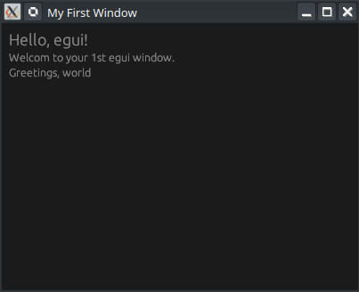

# Your First egui Window

[egui TopBottomPanel Tutorial - Recipe Viewer App | Learn Rust GUI Ep 1](https://www.youtube.com/watch?v=Sw6PXx5t5ck)

---

Cette vidéo, intitulée **"Your First egui Window"**, est le premier épisode d'une série dédiée à l'apprentissage de la bibliothèque graphique **egui** en Rust, en utilisant l'éditeur Neovim.

---

# Création d'une application Desktop avec Rust et egui

### 1. Architecture de base
La vidéo explique la distinction fondamentale entre les deux composants principaux utilisés [[00:13](http://www.youtube.com/watch?v=ArLqY_B78Hg&t=13)] :
- **egui** : Une bibliothèque de type *Immediate Mode GUI* (IMGUI) qui dessine l'interface utilisateur.
- **eframe** : Le framework de support (wrapper) qui fournit la fenêtre native du système d'exploitation dans laquelle **egui** s'affiche.

### 2. Configuration du Projet
Pour démarrer, le tutoriel suit ces étapes de configuration :
- **Initialisation** : `cargo new` pour créer le projet [[00:49](http://www.youtube.com/watch?v=ArLqY_B78Hg&t=49)].
- **Dépendances** : Ajout de `eframe` (version 0.31 dans la vidéo) dans le fichier `Cargo.toml` [[01:14](http://www.youtube.com/watch?v=ArLqY_B78Hg&t=74)].

### 3. Structure du Code et Composants
Le code fourni se divise en trois parties essentielles :

| Composant | Rôle dans le code | Explication |
| :--- | :--- | :--- |
| **`struct MyApp`** | État de l'application | Stocke les données dynamiques, ici le champ `name` [[03:50](http://www.youtube.com/watch?v=ArLqY_B78Hg&t=230)]. |
| **`impl Default`** | État initial | Définit les valeurs par défaut au lancement (ex: `name` = "world") [[04:20](http://www.youtube.com/watch?v=ArLqY_B78Hg&t=260)]. |
| **`impl eframe::App`** | Logique d'affichage | La fonction `update` est appelée à chaque image (frame) pour dessiner l'UI [[05:25](http://www.youtube.com/watch?v=ArLqY_B78Hg&t=325)]. |

### 4. Construction de l'Interface (UI)
À l'intérieur de la fonction `update`, le tutoriel introduit les widgets de base [[05:44](http://www.youtube.com/watch?v=ArLqY_B78Hg&t=344)] :
- **`CentralPanel`** : Remplit tout l'espace disponible de la fenêtre.
- **`heading`** : Affiche un titre en texte large [[06:04](http://www.youtube.com/watch?v=ArLqY_B78Hg&t=364)].
- **`label`** : Affiche du texte normal.
- **`format!`** : Utilisé pour injecter dynamiquement les données de la structure (`self.name`) dans l'interface [[06:14](http://www.youtube.com/watch?v=ArLqY_B78Hg&t=374)].

### 5. Lancement de l'Application (`fn main`)
La fonction `main` configure et lance la fenêtre native [[02:10](http://www.youtube.com/watch?v=ArLqY_B78Hg&t=130)] :
- **`NativeOptions`** : Permet de définir les paramètres de la fenêtre.
- **`ViewportBuilder`** : Utilisé spécifiquement pour définir la taille initiale (400x300 pixels dans votre code) [[02:28](http://www.youtube.com/watch?v=ArLqY_B78Hg&t=148)].
- **`run_native`** : La fonction qui démarre la boucle d'événements et affiche la fenêtre à l'écran [[02:58](http://www.youtube.com/watch?v=ArLqY_B78Hg&t=178)].

### Points clés à retenir [[08:21](http://www.youtube.com/watch?v=ArLqY_B78Hg&t=501)] :
1.  **Framework** : `eframe` gère la fenêtre, `egui` gère le contenu.
2.  **Configuration** : Utilisez `NativeOptions` pour l'apparence technique de la fenêtre.
3.  **Trait App** : Tout se passe dans `update`, qui rafraîchit l'interface en continu.
4.  **Layout** : Le `CentralPanel` est le conteneur principal par défaut.
5.  **Compilation** : Un simple `cargo build` suffit pour générer l'exécutable natif [[09:02](http://www.youtube.com/watch?v=ArLqY_B78Hg&t=542)].

Vidéo source : [Your First egui Window — Rust GUI Tutorial](https://www.youtube.com/watch?v=ArLqY_B78Hg)

