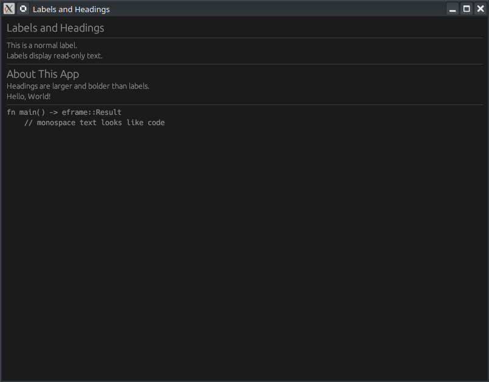

# 📝 Tutoriel egui #2 : Labels et Titres (Headings)

[Rust egui Tutorial #2 — Text Widgets: Labels, Headings & More - YouTube](https://www.youtube.com/watch?v=ef9-_bRYrUU)



---

Cette vidéo fait partie d'une série d'apprentissage de la bibliothèque GUI **egui** en Rust, utilisant le framework **eframe**. L'objectif est de maîtriser l'affichage de texte statique et dynamique.

### 🎥 Contenu de la Vidéo
Le tutoriel guide l'utilisateur à travers la création d'une application fenêtrée simple pour démontrer quatre widgets de texte fondamentaux.

#### 1. Les 4 Widgets de Texte Clés

```rust
ui.heading("Labels and Headings");

ui.separator();

ui.label("This is a normal label.");
ui.label("Labels display read-only text.");

ui.separator();

ui.heading("About This App");
ui.label("Headings are larger and bolder than labels.");
ui.label( format!("Hello, {}!", self.name));

ui.separator();

ui.monospace("fn main() -> eframe::Result");
ui.monospace("	// monospace text looks like code");
```

| Widget               | Fonction                        | Apparence                            |
| :------------------- | :------------------------------ | :----------------------------------- |
| **`ui.heading()`**   | Affiche un titre de section     | Texte large et en gras.              |
| **`ui.label()`**     | Affiche du texte standard       | Texte normal en lecture seule.       |
| **`ui.separator()`** | Ajoute un trait de séparation   | Ligne horizontale visuelle.          |
| **`ui.monospace()`** | Affiche du texte de type "code" | Police à largeur fixe (chasse fixe). |

#### 2. Concepts techniques abordés
- **Initialisation :** Configuration de la fenêtre avec `NativeOptions` et `ViewportBuilder` (taille 400x350).
- **Texte Dynamique :** Utilisation de la macro `format!()` pour intégrer des variables de l'état de l'application (ex: `self.name`) dans les labels.
- **Structure de l'App :** Définition d'une `struct MyApp` qui implémente le trait `eframe::App`.
- **Interface (UI) :** Tout le dessin se fait à l'intérieur de `central_panel`.

---

# 🦀 Analyse du Code Rust
Le code du dépôt [egui_labels_and_headings](https://github.com/GoCelesteAI/egui_labels_and_headings) suit la structure standard d'une application `eframe`.

### Structure du projet (`Cargo.toml`)
Il nécessite la dépendance suivante :
```toml
[dependencies]
eframe = "0.31"
```

### Logique du code (`main.rs`)
Voici comment les widgets sont implémentés dans la fonction `update` de l'application :

1.  **Définition de l'état :**
    ```rust
    struct MyApp {
        name: String,
    }
    ```

2.  **Initialisation de l'état :**
    ```rust
        impl Default for MyApp {
            fn default() -> Self {
                Self {
                    name: "World".to_string(),
                }
        }
    }
    ```


3.  **Configuration de l'interface :**
    ```rust
    impl eframe::App for MyApp {
        fn update(&mut self, ctx: &egui::Context, _frame: &mut eframe::Frame) {
            egui::CentralPanel::default().show(ctx, |ui| {
                ui.heading("Labels and Headings");

                ui.separator();

                ui.label("This is a normal label.");
                ui.label("Labels display read-only text.");

                ui.separator();

                ui.heading("About This App");
                ui.label("Headings are larger and bolder than labels.");
                ui.label( format!("Hello, {}!", self.name));

                ui.separator();

                ui.monospace("fn main() -> eframe::Result");
                ui.monospace("	// monospace text looks like code");
            });
        }
    }
    ```

### Points Clés du Code
- **Immédiat (Immediate Mode) :** L'interface est "redessinée" à chaque frame dans la fonction `update`. Si `self.name` change, le label se met à jour instantanément.
- **Simplicité :** Contrairement à d'autres frameworks (comme Qt ou GTK), il n'y a pas de gestionnaire de mise en page complexe ; les éléments s'empilent verticalement par défaut.
- **Boilerplate :** La fonction `main` utilise `eframe::run_native` pour lancer la boucle d'événements et créer la fenêtre système.

