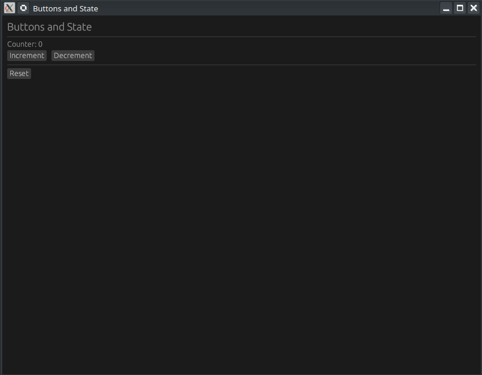

---

# 🦀 Résumé : Création d'une App de Compteur avec egui (Ep. 3)

[Build a Counter App in Rust egui — Buttons and State (Ep 3) - YouTube](https://www.youtube.com/watch?v=2Tnz8MFqCi4)

Cette vidéo enseigne comment rendre une application interactive en utilisant des boutons et la gestion d'état (*state*) dans le framework Rust **egui**.




## 🎥 Contenu de la Vidéo


### 1. Objectifs d'apprentissage
- **Interactivité** : Utiliser `ui.button()` pour créer des éléments cliquables.
- **Détection d'actions** : Utiliser la méthode `.clicked()` pour modifier les données.
- **Mise en page** : Organiser les widgets horizontalement avec `ui.horizontal()`.
- **Persistance** : Stocker l'état dans une structure (`struct`) pour qu'il survive entre chaque rafraîchissement d'image (*frame*).
- **Modularité** : Séparer le code en deux fichiers (`main.rs` et `app.rs`).


### 2. Structure du projet
Le projet est divisé pour une meilleure clarté :
- **`main.rs`** : Configure la fenêtre (taille, titre) et lance l'application.
- **`app.rs`** : Contient la logique métier et l'interface utilisateur.

---

## 💻 Analyse du Code Rust

Le code est basé sur la bibliothèque `eframe` (le framework de bureau pour `egui`).

### A. La Structure de l'Application (`app.rs`)
L'état de l'application est défini dans une structure simple.

| Composant          | Rôle                                                           |
| :----------------- | :------------------------------------------------------------- |
| `pub struct MyApp` | Contient la donnée `counter: i32`.                             |
| `impl Default`     | Initialise le compteur à `0` au démarrage.                     |
| `impl eframe::App` | Contient la fonction `update` qui dessine l'UI à chaque frame. |

### B. Logique de l'Interface Utilisateur
Dans la fonction `update`, le code utilise les éléments suivants :

- **Affichage** : `ui.heading("Counter App")` et `ui.label(format!("Valeur : {}", self.counter))`.
- **Boutons et Actions** :
    ```rust
    ui.horizontal(|ui| {
        if ui.button("Incrémenter").clicked() {
            self.counter += 1;
        }
        if ui.button("Décrémenter").clicked() {
            self.counter -= 1;
        }
    });
    ```
- **Réinitialisation** : Un bouton "Reset" qui remet `self.counter = 0`.

---

## 🔑 Points Clés à Retenir

1.  **Le bouton est une réponse** : En egui, `ui.button("Texte")` renvoie un objet de réponse. On vérifie immédiatement si le bouton a été cliqué avec `.clicked()`.
2.  **L'état est mutable** : La fonction `update` prend `&mut self`, ce qui permet de modifier directement les valeurs de la structure `MyApp`.
3.  **Mise en page automatique** : Par défaut, egui place les éléments les uns sous les autres. Pour les mettre côte à côte, il faut encapsuler les boutons dans une fermeture (*closure*) `ui.horizontal(|ui| { ... })`.
4.  **Configuration de la fenêtre** : Dans le `main.rs`, l'utilisation de `NativeOptions` et `ViewportBuilder` permet de définir la taille initiale (ex: 400x350 pixels).

