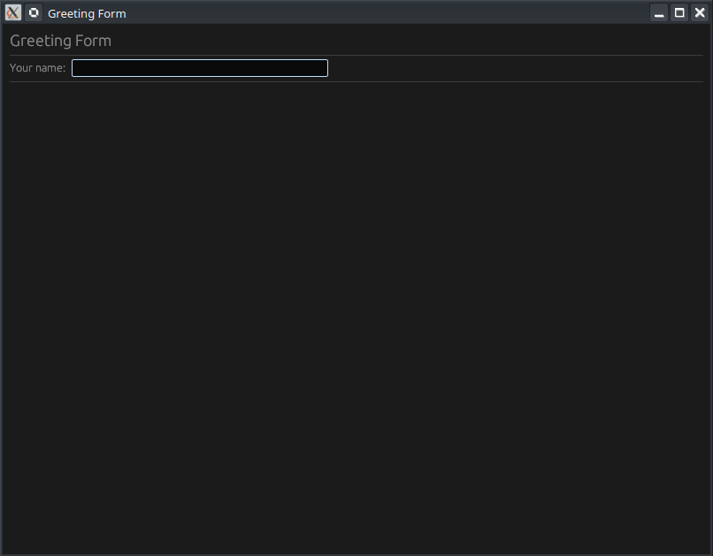

# 📝 Résumé : egui Text Input — Créer un formulaire de salutation (Ép. 4)

[Rust egui Text Input — Build a Greeting Form (Ep 4) - YouTube](https://www.youtube.com/watch?v=wW0FNiCm_aI)




Cette vidéo fait partie d'une série sur l'apprentissage de la bibliothèque graphique **egui** en Rust, utilisant l'éditeur **Neovim**. L'objectif est de créer une application simple qui affiche un message de bienvenue personnalisé en temps réel dès que l'utilisateur saisit son nom.

### 🔑 Points clés de l'apprentissage
* **Saisie de texte :** Utilisation de `text_edit_singleline()` pour créer un champ de saisie sur une seule ligne.
* **Gestion de l'état :** Stockage de la saisie utilisateur dans un champ de type `String` au sein de la structure de l'application.
* **Liaison de données (Binding) :** Utilisation de `&mut` pour lier directement le champ de texte à la variable d'état.
* **Mode Immédiat :** Comprendre que l'interface est redessinée à chaque image, permettant une mise à jour instantanée de l'affichage.
* **Logique conditionnelle :** Utilisation de `.is_empty()` pour n'afficher le message que si un nom a été saisi.

### 🛠️ Structure du Projet
Le projet est divisé en deux fichiers principaux pour une meilleure organisation :
1.  **`main.rs`** : Configure la fenêtre native de l'application (titre, taille initiale) et lance la boucle d'exécution.
2.  **`app.rs`** : Contient la logique métier, la structure des données et le dessin de l'interface utilisateur (UI).

---

# 💻 Analyse du Code Rust (`egui_text_input`)

Le code est conçu de manière modulaire. Voici les composants essentiels du dépôt GitHub mentionné :

### 1. La Structure de l'Application
Elle définit les données que l'application doit "mémoriser" entre chaque rafraîchissement d'image.
```rust
pub struct MyApp {
    name: String, // Stocke le texte saisi par l'utilisateur
}

impl Default for MyApp {
    fn default() -> Self {
        Self {
            name: String::new(), // Initialisé vide au démarrage
        }
    }
}
```

### 2. La Méthode `update` (Cœur de l'UI)
C'est ici que l'interface est définie. Elle est appelée à chaque frame (60 fois par seconde ou plus).

| Élément UI              | Fonction Rust                             | Rôle                                                                   |
| :---------------------- | :---------------------------------------- | :--------------------------------------------------------------------- |
| **Panneau Central**     | `egui::CentralPanel::default().show(...)` | Définit la zone principale de la fenêtre.                              |
| **Champ de texte**      | `ui.text_edit_singleline(&mut self.name)` | Crée l'input et le lie à la variable `self.name`.                      |
| **Affichage Dynamique** | `if !self.name.is_empty() { ... }`        | Affiche le message de bienvenue uniquement si le champ n'est pas vide. |

### 3. Exemple de logique d'affichage
```rust
ui.horizontal(|ui| {
    ui.label("Your name:");
    ui.text_edit_singleline(&mut self.name);
});

if !self.name.is_empty() {
    ui.label(format!("Hello, {}!", self.name));
}
```

---

### 🚀 Conclusion du tutoriel
La vidéo démontre la puissance du **mode immédiat** d'egui : contrairement à d'autres frameworks (comme Qt ou GTK), vous n'avez pas besoin de gérer des "callbacks" ou des "événements" complexes pour mettre à jour l'affichage. Vous liez simplement votre variable à un composant, et egui s'occupe de refléter les changements instantanément.