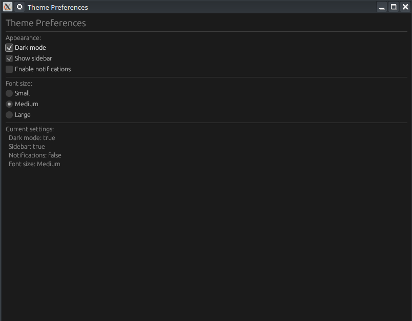

# 🛠️ Résumé Vidéo : egui Checkboxes & Radios (Épisode 5)

[Rust egui Checkboxes & Radios — Build Theme Preferences (Ep 5) - YouTube](https://www.youtube.com/watch?v=8a2b1H5pKX0)



Cette vidéo de la série "Learn egui in Neovim" explique comment intégrer des éléments de sélection interactive (cases à cocher et boutons radio) dans une application Rust en utilisant la bibliothèque `egui`.

## 📌 Points Clés de l'Apprentissage
- **Cases à cocher (`ui.checkbox`)** : Utilisées pour basculer des états booléens (On/Off).
- **Boutons Radio (`ui.radio_value`)** : Utilisés pour choisir une option unique parmi plusieurs via des `enums`.
- **Trait `PartialEq`** : Indispensable pour permettre à `egui` de comparer les variantes d'énumérations et d'identifier l'option sélectionnée.
- **Mise à jour en direct** : L'interface reflète instantanément les changements d'état grâce au mode immédiat (*immediate mode*) d'egui.

## 📝 Structure du Projet
Le projet est divisé en deux fichiers principaux pour une meilleure organisation :
1.  **`main.rs`** : Configure la fenêtre native avec `eframe` et lance l'application.
2.  **`app.rs`** : Contient la logique métier, la structure de données (`MyApp`) et l'interface utilisateur.

---

# 💻 Analyse du Code Rust

Le code simule un panneau de "Préférences de Thème". Voici les éléments techniques structurants :

### 1. Définition des Données (Enums et Structs)
L'utilisation de `#[derive(PartialEq)]` sur l'énumération est cruciale pour le fonctionnement des boutons radio.

```rust
#[derive(PartialEq)]
enum FontSize { Small, Medium, Large }

struct MyApp {
    dark_mode    : bool,
    show_sidebar : bool,
    notifications: bool,
    font_size    : FontSize,
}
```

### 2. Implémentation de l'Interface (`update` function)

Le tableau suivant résume comment les composants sont liés aux données :

| Composant UI     | Fonction Rust      | Liaison de donnée (Binding)            | Usage                             |
| :--------------- | :----------------- | :------------------------------------- | :-------------------------------- |
| **Checkbox**     | `ui.checkbox()`    | `&mut self.dark_mode`                  | Activer/Désactiver le mode sombre |
| **Radio Button** | `ui.radio_value()` | `&mut self.font_size, FontSize::Small` | Sélectionner une taille précise   |


### 3. Logique d'affichage
Le code utilise un bloc `match` pour transformer l'état interne (`enum`) en texte lisible par l'utilisateur dans l'interface de prévisualisation :

```rust
// Code explicatif...
let size_text = match self.font_size {
    FontSize::Small =>  "Small",
    FontSize::Medium => "Medium",
    FontSize::Large =>  "Large",
};

ui.label(format!("Taille sélectionnée : {}", size_text));
// Code explicatif...
```

---

# 🚀 Résumé des commandes utiles
Si vous souhaitez tester le code localement (comme montré dans la vidéo) :

- **Créer le projet** : `cargo new theme_prefs`
- **Dépendance à ajouter** (`Cargo.toml`) : `eframe = "0.31"`
- **Lancer l'application** : `cargo run`

**En résumé :** Ce tutoriel démontre la simplicité du "binding" de données dans `egui`. Il suffit de passer une référence mutable (`&mut`) à un composant pour que l'UI et l'état de votre programme restent parfaitement synchronisés.