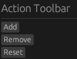
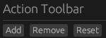
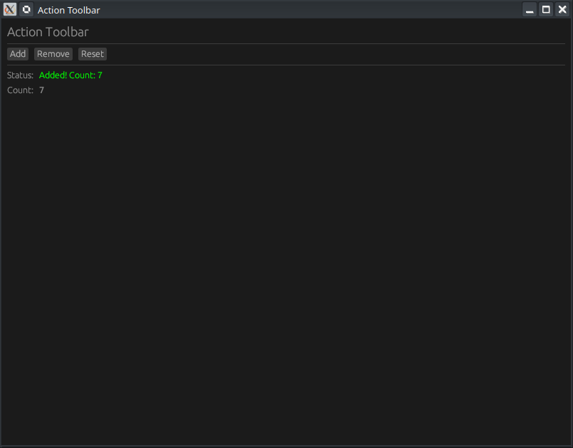

# 🛠️ Tutoriel egui : Création d'une Barre d'Outils Horizontale

Ce tutoriel (Épisode 6 de la série "Learn egui in Neovim") enseigne comment organiser des widgets côte à côte en utilisant la fonction `ui.horizontal`.

**Sans `ui.horizontal` :**



**Avec `ui.horizontal` :**



## 1. Concepts Clés de la Vidéo
L'objectif est de construire une **barre d'outils d'action** comprenant des boutons pour incrémenter, décrémenter et réinitialiser un compteur, le tout aligné sur une seule ligne.

### Les 5 points à retenir :
- **`ui.horizontal(|ui| { ... })`** : La fonction principale pour placer des widgets les uns à côté des autres.
- **Utilisation des Closures** : Le contenu de la ligne est regroupé dans une closure (bloc de code).
- **Paires Libellé-Valeur** : Utiliser plusieurs blocs horizontaux pour aligner proprement un texte et sa donnée associée.
- **Flexibilité** : On peut mélanger librement des boutons, des étiquettes (labels) et d'autres widgets dans une même ligne.
- **Séparateurs** : `ui.separator()` permet de diviser visuellement la barre d'outils du reste de l'affichage.

---


## 2. Structure du Code Rust
Le projet est divisé en deux fichiers principaux : `main.rs` pour le lancement et `app.rs` pour la logique de l'interface.

### 📦 Configuration (`Cargo.toml`)
Le projet utilise la version **0.31** de `eframe` (le framework wrapper pour egui).

### 🖥️ Logique de l'application (`app.rs`)
Le code définit une structure `MyApp` qui gère l'état de l'interface.

| Composant                     | Rôle                                                            |
| :---------------------------- | :-------------------------------------------------------------- |
| **Structure `MyApp`**         | Stocke un message (`String`) et un compteur (`i32`).            |
| **`Default`**                 | Initialise le message à "Ready" et le compteur à 0.             |
| **`ui.horizontal` (Boutons)** | Contient 3 boutons : `Add` (+1), `Remove` (-1), et `Reset` (0). |
| **`ui.horizontal` (Status)**  | Aligne le texte "Status:" avec la variable de message.          |
| **`ui.horizontal` (Count)**   | Aligne le texte "Count:" avec la valeur numérique du compteur.  |

---


## 3. Extrait du Code Source (`egui_horizontal_layout`)
Voici comment la disposition horizontale est implémentée concrètement dans le code :

```rust
// Extrait de la fonction update dans app.rs
ui.heading("Action Toolbar");
ui.separator();

// Ligne des boutons d'action
ui.horizontal(|ui| {
    if ui.button("Add").clicked() {
        self.count += 1;
        self.message = format!("Added! Count: {}", self.count);
    }
    if ui.button("Remove").clicked() {
        self.count -= 1;
        self.message = format!("Removed! Count: {}", self.count);
    }
    if ui.button("Reset").clicked() {
        self.count = 0;
        self.message = String::from("Reset!");
    }
});

ui.add_space(10.0); // Espacement vertical

// Ligne de statut
ui.horizontal(|ui| {
    ui.label("Status:");
    ui.colored_label(egui::Color32::GREEN, &self.message);
});

// Ligne du compteur
ui.horizontal(|ui| {
    ui.label("Count:");
    ui.monospace(self.count.to_string());
});
```



---


## 4. Résumé des étapes de développement
1.  **Initialisation** : Création du projet avec `cargo new`.
2.  **Boilerplate** : Configuration de `main.rs` avec `NativeOptions` pour définir la taille de la fenêtre.
3.  **State Management** : Définition des données de l'application dans une `struct`.
4.  **Layout** : Utilisation de `ui.horizontal` pour chaque groupe d'éléments devant apparaître sur une ligne.
5.  **Compilation** : Exécution via `cargo run` pour tester l'interactivité des boutons.