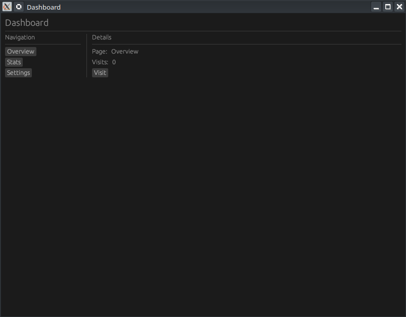

# 📊 Tutoriel egui : Layouts Imbriqués (Épisode 7)



Ce tutoriel enseigne comment structurer une interface utilisateur complexe en combinant des dispositions verticales et horizontales pour créer un tableau de bord à deux colonnes.


## 1. Concepts Clés de Mise en Page
Pour construire des interfaces riches, on utilise l'imbrication de conteneurs :

- **`ui.vertical(|ui| { ... })`** : Aligne les widgets de haut en bas.
- **`ui.horizontal(|ui| { ... })`** : Aligne les widgets de gauche à droite.
- **Imbrication** : En plaçant un `ui.vertical` à l'intérieur d'un `ui.horizontal`, on crée des **colonnes**.
- **`ui.separator()`** : Ajoute une ligne de division visuelle entre les sections.


## 2. Structure de l'Application (Code Rust)

Le projet est divisé en deux parties principales : la configuration de la fenêtre (`main.rs`) et la logique de l'interface (`app.rs`).

### Configuration du Projet (`Cargo.toml`)
Le projet utilise la bibliothèque **eframe** (le framework de framework pour egui).
```toml
[dependencies]
eframe = "0.31"
```

### Logique de l'Interface (`app.rs`)
Le code repose sur une structure `MyApp` qui gère l'état de l'affichage.

| Composant      | Rôle                                                                                     |
| :------------- | :--------------------------------------------------------------------------------------- |
| **`selected`** | Une chaîne de caractères (`String`) qui suit la page active (Overview, Stats, Settings). |
| **`count`**    | Un entier (`i32`) pour démontrer l'interactivité via un compteur de visites.             |
| **`update`**   | La fonction appelée à chaque frame pour dessiner l'UI.                                   |

#### Organisation visuelle du code :
1.  **En-tête** : Titre de l'application avec `ui.heading`.
2.  **Conteneur Principal** : Un `ui.horizontal` qui englobe toute la partie inférieure.
3.  **Colonne Gauche (Sidebar)** :
    - Utilise `ui.vertical`.
    - Contient des `ui.selectable_label` ou `ui.button` pour la navigation.
    - Une largeur maximale est fixée pour contraindre la barre latérale.
4.  **Séparateur** : `ui.separator()` pour diviser proprement les deux zones.
5.  **Colonne Droite (Contenu)** :
    - Affiche les détails en fonction de la variable `selected`.
    - Utilise des mini-layouts horizontaux pour aligner les étiquettes et leurs valeurs (ex: "Page: Overview").


## 3. Fonctionnement du Compteur
L'interactivité est gérée simplement :
- Un bouton "Visit" est placé dans la zone de détails.
- Lors d'un clic (`if ui.button("...").clicked()`), la variable `self.count` est incrémentée.
- L'UI se rafraîchit immédiatement pour afficher la nouvelle valeur.


## 4. Points à Retenir (Takeaways)
1.  **Hiérarchie** : Toujours penser l'UI comme une poupée russe de boîtes horizontales et verticales.
2.  **Contraintes** : Utiliser `set_max_width` sur la sidebar pour éviter qu'elle ne prenne trop de place.
3.  **État local** : L'utilisation d'énums ou de strings dans la structure de l'app permet de basculer facilement entre "pages" sans changer de fenêtre.

