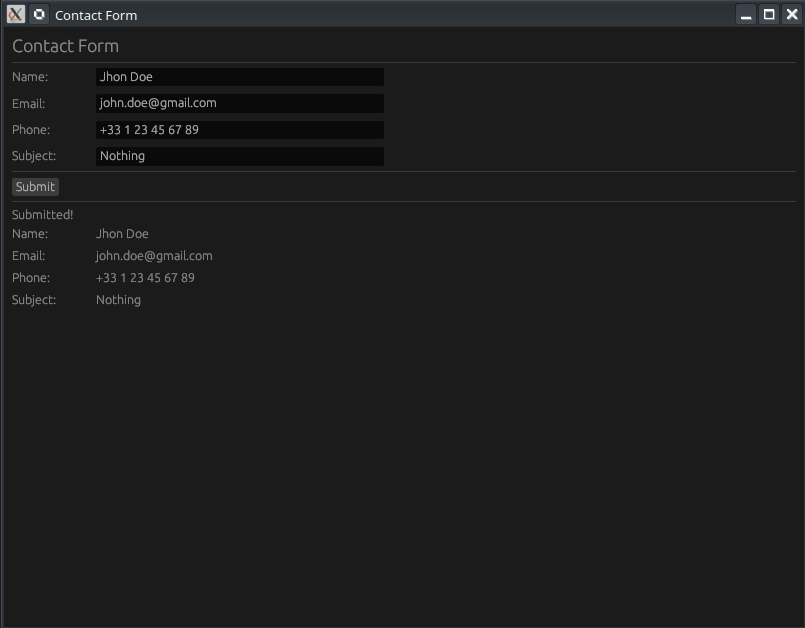

# Résumé : Mise en page avec `egui::Grid` (Épisode 8)

[Rust egui Grid Layout — Build an Aligned Contact Form (Ep 8) - YouTube](https://www.youtube.com/watch?v=yuH5cZN0md8)

Cette vidéo explique comment utiliser le layout `Grid` de la bibliothèque **egui** en Rust pour créer des interfaces parfaitement alignées, en prenant l'exemple d'un formulaire de contact.

## 1. Concepts Clés de `egui::Grid`
La grille permet d'organiser les widgets en lignes et colonnes de manière structurée.
- **`Grid::new("id_unique")`** : Initialise une nouvelle grille. Chaque grille doit avoir un identifiant de chaîne de caractères unique.
- **`.num_columns(n)`** : Définit le nombre de colonnes (ici, 2 : une pour les étiquettes, une pour les champs de saisie).
- **`.spacing([x, y])`** : Configure l'espacement horizontal et vertical entre les cellules.
- **`ui.end_row()`** : Indique explicitement la fin d'une ligne et le passage à la suivante.

## 2. Structure du Code Rust
Le projet est divisé en deux parties principales : la configuration de la fenêtre (`main.rs`) et la logique de l'application (`app.rs`).

### Architecture du Formulaire
| Champ          | Type de donnée | Widget egui            |
| :------------- | :------------- | :--------------------- |
| **Nom**        | `String`       | `TextEdit::singleline` |
| **Email**      | `String`       | `TextEdit::singleline` |
| **Téléphone**  | `String`       | `TextEdit::singleline` |
| **Sujet**      | `String`       | `TextEdit::singleline` |
| **Soumission** | `bool`         | `Button`               |

### Logique d'implémentation
1.  **Définition de la structure** : `MyApp` stocke les chaînes de caractères pour chaque champ et un booléen `submitted` pour l'état.
2.  **Affichage du formulaire** :
    - Ouverture d'un bloc `egui::Grid`.
    - Chaque ligne contient un `ui.label("...")` suivi du champ de saisie correspondant.
    - Appel de `ui.end_row()` après chaque paire label/input.
3.  **Traitement de la soumission** : Lorsque le bouton "Submit" est cliqué, `submitted` passe à `true`.
4.  **Affichage du résumé** : Si `submitted` est vrai, une seconde grille (avec un ID différent) affiche les données saisies pour vérification.

## 3. Points techniques retenus (Takeaways)
- **Alignement automatique** : La grille ajuste automatiquement la largeur des colonnes en fonction du contenu le plus large.
- **Identifiants uniques** : C'est crucial dans `egui` (mode immédiat) pour que le framework puisse suivre l'état des widgets d'une frame à l'autre.
