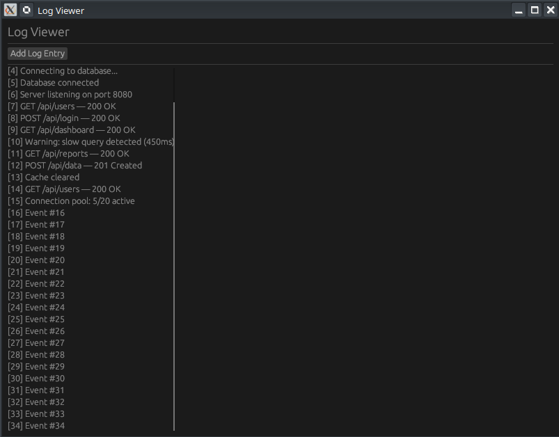

# Résumé : Création d'un Log Viewer avec `egui::ScrollArea`

[Learn egui in Neovim — Ep 10: Scroll Area (Log Viewer with Auto-Scroll) - YouTube](https://www.youtube.com/watch?v=ta7kRwTuSM4)



Ce tutoriel (Épisode 10 de la série "Learn egui in Neovim") enseigne comment utiliser les zones de défilement dans une application Rust en utilisant la bibliothèque `egui`. L'objectif est de créer un outil de visualisation de logs capable de défiler automatiquement vers le bas.


## 1. Concepts Clés et Fonctionnalités
L'application repose sur trois piliers principaux :
- **Zone de défilement (`ScrollArea`)** : Permet d'afficher un contenu qui dépasse la taille de la fenêtre.
- **Auto-scroll (`stick_to_bottom`)** : Force la vue à suivre les nouvelles entrées qui s'ajoutent en bas.
- **Gestion dynamique des données** : Utilisation d'un `Vec<String>` pour stocker et mettre à jour les lignes de logs.


## 2. Structure Technique du Code Rust

Le projet est divisé en deux fichiers principaux : `main.rs` (configuration de la fenêtre) et `app.rs` (logique de l'interface).

### Configuration du Projet (`Cargo.toml`)
La dépendance principale utilisée est `eframe` (le framework pour exécuter `egui`).
```toml
[dependencies]
eframe = "0.31"
```

### La Logique de l'Application (`app.rs`)
Le code définit une structure `MyApp` qui gère l'état de l'interface.

| Composant                    | Rôle Technique                                                                               |
| :--------------------------- | :------------------------------------------------------------------------------------------- |
| **Structure `MyApp`**        | Contient un `Vec<String>` pour les logs et un compteur pour numéroter les lignes.            |
| **`Default`**                | Initialise l'application avec quelques lignes de logs factices (simulant des requêtes HTTP). |
| **`ScrollArea::vertical()`** | Crée un conteneur qui permet le défilement vertical.                                         |
| **`.stick_to_bottom(true)`** | Propriété cruciale qui maintient le scroll en bas si l'utilisateur y est déjà.               |
| **`ui.button().clicked()`**  | Déclenche l'ajout d'une nouvelle entrée dans le vecteur de logs.                             |


## 3. Détails de l'implémentation

### Défilement automatique
Pour implémenter le visionneur de logs, le code utilise l'enchaînement de méthodes suivant :
```rust
egui::ScrollArea::vertical()
    .stick_to_bottom(true)
    .show(ui, |ui| {
        for (i, log) in self.logs.iter().enumerate() {
            ui.label(format!("{}: {}", i, log));
        }
    });
```
- **`enumerate()`** : Utilisé pour générer automatiquement l'index de la ligne de log lors de l'affichage.
- **`format!`** : Macro Rust pour construire la chaîne de caractères affichée dans chaque label.

### Workflow Neovim (mentionné dans la vidéo)
Le tutoriel met également en avant l'utilisation de l'éditeur Neovim pour le développement Rust :
- **Neo-tree** : Utilisé pour naviguer dans les fichiers.
- **Raccourci `s`** : Permet d'ouvrir un fichier dans une division horizontale (split) pour voir le code et le terminal simultanément.


## 4. Points à retenir
- **Efficacité** : `egui` est immédiat (Immediate Mode), ce qui signifie que l'interface est redessinée à chaque frame. Le `ScrollArea` gère efficacement ce rendu.
- **Expérience Utilisateur** : Le `stick_to_bottom` est indispensable pour toute application de type terminal ou chat afin que l'utilisateur voit toujours l'information la plus récente sans intervention manuelle.