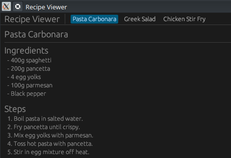
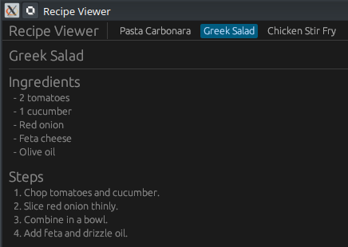
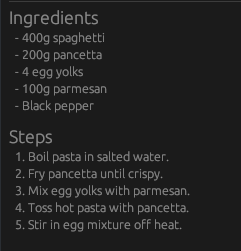

# 📜 Projet : Egui Recipe Viewer (Rust)

[egui TopBottomPanel Tutorial - Recipe Viewer App | Learn Rust GUI Ep 11 - YouTube](https://www.youtube.com/watch?v=Sw6PXx5t5ck)






Ce projet est un tutoriel (épisode 11 de la série "Learn egui in Neovim") qui enseigne comment construire une application de visualisation de recettes en utilisant le framework GUI **egui** en Rust.

## 🎥 Résumé de la Vidéo

La vidéo se concentre sur l'organisation de l'interface utilisateur en utilisant différents types de panneaux pour créer une mise en page professionnelle.

### Points Clés de l'Interface (Layout)
- **TopBottomPanel::top()** : Utilisé pour créer une barre de menu supérieure contenant des onglets cliquables.
- **TopBottomPanel::bottom()** : Utilisé pour créer une barre de statut inférieure affichant les détails de la recette (temps de préparation, portions, catégorie).
- **CentralPanel** : Remplit l'espace restant pour afficher le contenu principal (ingrédients et étapes).
- **Selectable Label** : Utilisé pour créer les onglets de navigation qui mettent en évidence la recette sélectionnée.

### Fonctionnalités de l'Application
1.  **Navigation par onglets** : Passer d'une recette à l'autre (ex: Pasta Carbonara, Salade Grecque, Poulet sauté).
2.  **Affichage dynamique** : La barre de statut et la zone centrale se mettent à jour instantanément selon l'index de la recette choisie.
3.  **Formatage du contenu** : Utilisation de listes à puces pour les ingrédients et de listes numérotées pour les instructions de cuisson.

---

## 💻 Structure du Code Rust

Le code est divisé principalement en deux fichiers : `main.rs` et `app.rs`.


### 1. Gestion des Données

Contrairement à une application complexe, les données sont gérées via une simple structure `Recipe` et un vecteur :

  - **`struct Recipe`** : Définit les champs `title`, `category`, `prep_time`, `servings`, `ingredients` (Vec\<String\>) et `instructions`.
  - **Fonction `get_recipes()`** : Une fonction auxiliaire qui retourne un `Vec<Recipe>` contenant les données en dur (Hardcoded) pour l'exemple.


### 2. Logique de l'Interface
Le trait `eframe::App` est implémenté pour l'application avec la fonction `update` :

- **Barre Supérieure** : Une boucle `for` parcourt les recettes et crée un `ui.selectable_label` pour chacune.
- **Barre Inférieure** : Affiche les métadonnées de la recette active.
- **Panneau Central** :
    - Affiche le titre en grand.
    - Liste les ingrédients avec un préfixe `-`.
    - Énumère les étapes de préparation.

Tout se passe dans la fonction principale qui configure la fenêtre native via `eframe::run_native`.

| Composant        | Implémentation dans le code                                                                                                           |
| :--------------- | :------------------------------------------------------------------------------------------------------------------------------------ |
| **État (State)** | L'index de la recette sélectionnée est stocké dans une variable mutable `selected_recipe_index` à l'intérieur de la closure d'update. |
| **Boucle d'UI**  | L'interface est définie dans une *closure* (lambda) `|ctx, _frame| { ... }`.                                                          |


### 3. Découpage de l'Interface (UI Layout)

Le code suit strictement cette hiérarchie de panneaux :

#### A. Barre de Navigation (Top Panel)

```rust
egui::TopBottomPanel::top("top_panel").show(ctx, |ui| {
    ui.horizontal(|ui| {
        // Boucle sur les recettes pour créer des boutons (Selectable Labels)
        // Si cliqué, selected_recipe_index est mis à jour.
    });
});
```


#### B. Barre de Statut (Bottom Panel)

```rust
egui::TopBottomPanel::bottom("status_bar").show(ctx, |ui| {
    let recipe = &self.recipes[self.selected];
        ui.horizontal(|ui| {
        ui.label(format!("Category: {}", recipe.category));
        ui.separator();

        ui.label(format!("Time: {}", recipe.time));
        ui.separator();

        ui.label(format!("Servings: {}", recipe.servings));
      });
  });
```

Située en bas, elle extrait les données de `recipes[selected_recipe_index]` :

  - Affiche la catégorie, le temps de préparation et le nombre de portions sur une seule ligne.


#### C. Zone de Contenu (Central Panel)

C'est ici que les détails sont rendus :

  - **Titre** : Utilise `ui.heading()`.
  - **Ingrédients** : Une section qui itère sur la liste des ingrédients et les affiche avec un préfixe `"  - "`.
  - **Instructions** : Affiche le bloc de texte des étapes de préparation.

```rust
egui::CentralPanel::default().show(ctx, |ui| {
    let recipe = &self.recipes[self.selected];

    ui.heading(&recipe.title);
    ui.separator();

    ui.heading("Ingredients");
    for item in &recipe.ingredients {
        ui.label(format!("  - {}", item));
    }

    ui.add_space(10.0);
    ui.heading("Steps");
    for (i, step) in recipe.steps.iter().enumerate() {
        ui.label(format!("  {}. {}", i + 1, step));
    }
});
```




### 4. Configuration du Projet (`Cargo.toml`)

La dépendance principale utilisée est :
```toml
[dependencies]
eframe = "0.31" # Version utilisée dans le tutoriel
```

### 5. 🛠️ Spécificités Techniques constatées

  - **Mutable State** : Comme il n'y a pas de `struct` d'application globale, l'état est maintenu grâce à la persistance de la closure de `eframe`.
  - **Zéro Dépendance externe lourde** : Le projet repose uniquement sur `eframe` (egui + framework natif).
  - **Simplicité** : Le code privilégie la clarté pédagogique (montrer comment les panneaux `top/bottom/central` interagissent) plutôt qu'une architecture logicielle complexe.

----

## Conclusion

Ce projet démontre la simplicité de **egui** pour créer des mises en page structurées avec très peu de code, tout en gérant un état dynamique (sélection de recettes) de manière efficace.
