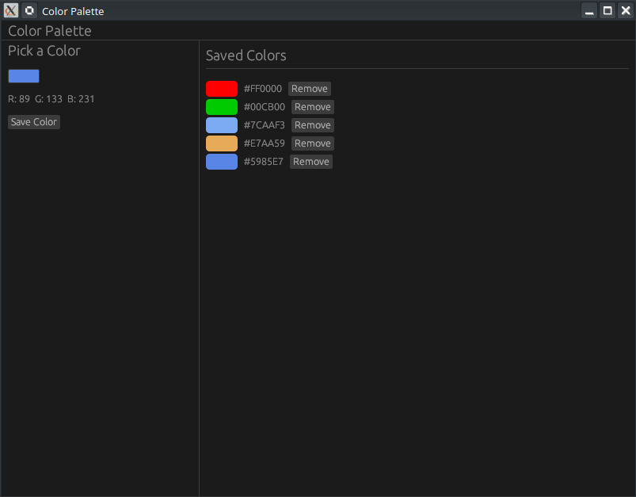
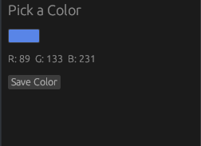
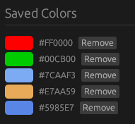

# 🎨 Projet : Egui Color Picker (Rust)

[Build a Color Palette App with egui Color Picker | Rust GUI Ep 12 - YouTube](https://www.youtube.com/watch?v=_ZkwNm4Ow5E)

Ce tutoriel (épisode 12 de la série) enseigne comment créer une application de gestion de palette de couleurs. L'objectif est d'apprendre à manipuler les sélecteurs de couleurs, la conversion d'espaces colorimétriques et le dessin personnalisé de formes (swatches) avec le framework **egui**.

## 🎥 Résumé de la Vidéo

La vidéo guide l'utilisateur dans la création d'une interface scindée en deux : une zone de contrôle pour choisir une couleur et une zone d'affichage pour les couleurs sauvegardées.

### Concepts Clés de l'UI
- **`color_edit_button_rgb`** : Utilisation du widget natif d'egui pour ouvrir un sélecteur de couleur interactif.
- **Gestion des Espaces Colorimétriques** : Passage de `Rgba` (valeurs flottantes 0.0-1.0) à `Color32` (valeurs 8 bits 0-255) pour l'affichage.
- **Dessin Personnalisé (Painter)** : Utilisation de `painter().rect_filled()` pour dessiner les carrés de couleur de la palette.
- **Mise en page (Layout)** : Emploi d'un `SidePanel` pour les contrôles et d'un `CentralPanel` pour la galerie de couleurs.

---

## 💻 Structure du Code Rust

Le projet est organisé de manière modulaire avec une structure d'application claire.

### 1. Modèle de Données (`app.rs`)
L'état de l'application est encapsulé dans une structure `MyApp` :

| Composant       | Type            | Description                                                              |
| :-------------- | :-------------- | :----------------------------------------------------------------------- |
| `current_color` | `[f32; 3]`      | Stocke la couleur actuellement sélectionnée dans le picker (format RGB). |
| `saved_colors`  | `Vec<[f32; 3]>` | Liste des couleurs ajoutées à la palette par l'utilisateur.              |

### 2. Logique d'Affichage
Le code implémente le trait `eframe::App` avec les sections suivantes :

- **Le Panneau Latéral (Gauche)** :
    - Contient le bouton `color_edit_button_rgb`.
    - Affiche les valeurs numériques RGB de la couleur actuelle.
    - Bouton "Save Color" qui pousse la couleur actuelle dans le vecteur `saved_colors`.

    

- **Le Panneau Central** :
    - Utilise une boucle pour afficher chaque couleur sauvegardée.
    - **Formatage Hexadécimal** : Les couleurs sont affichées en code Hex (ex: `#FFA500`) en utilisant le formatage Rust `{:02X}`.
    - **Widget Personnalisé** : Pour chaque couleur, le code réserve un espace (`allocate_exact_size`) et dessine un rectangle rempli avec la couleur correspondante.

    

### 3. Fonctions Utilitaires
- **`Color32::from_rgb`** : Crucial pour convertir les composants `f32` (utilisés par le sélecteur) en `u8` nécessaires pour le rendu final à l'écran.

---

## 🛠️ Configuration et Environnement
- **Dépendances** : Utilise `eframe = "0.31"`.
- **Éditeur** : Démonstration faite sous **Neovim** avec l'utilisation de `Neo-tree` (touche `P` pour prévisualiser les fichiers).
- **Fenêtre** : Initialisée en 800x600 via `NativeOptions` dans le `main.rs`.

**En résumé :** Ce projet est une excellente introduction à la manipulation des couleurs dans egui, montrant comment combiner des widgets intégrés (le picker) avec du dessin manuel (les rectangles de couleur) tout en gérant une liste dynamique d'éléments.