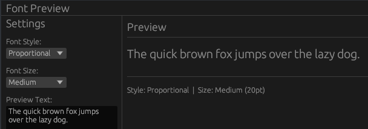

# 🛠️ Tutoriel : Implémentation d'une ComboBox avec egui

[egui Dropdown Menus in Rust — ComboBox + FontId + RichText | Ep 13 - YouTube](https://www.youtube.com/watch?v=30B02lADr3k)



Ce projet démontre comment intégrer un menu déroulant (ComboBox) fonctionnel dans une application Rust utilisant `eframe/egui`, permettant à l'utilisateur de choisir une option parmi une liste définie.

## 🎥 Résumé de la Vidéo

La vidéo se concentre sur la gestion de l'état (state) et l'interaction utilisateur via les widgets de sélection.

### Points clés abordés :
- **Initialisation de l'état** : Comment définir une variable pour suivre l'option sélectionnée par l'utilisateur.
- **Utilisation de `ComboBox::from_label`** : Le constructeur principal pour créer le widget.
- **Gestion de la sélection** : L'utilisation de la méthode `.selected_text()` pour afficher dynamiquement l'option courante sur le bouton du menu.
- **Mise à jour dynamique** : Comment l'interface réagit immédiatement au changement de sélection pour modifier d'autres éléments de l'UI (ex: changer un texte ou une couleur).

---

## 💻 Structure du Code Rust (`app.rs`)

Le code est minimaliste et se concentre sur l'interaction entre une liste de données et le widget.

### 1. Définition de l'Application
Contrairement à des applications complexes, l'état est ici géré simplement :
- **Variable de sélection** : Une chaîne de caractères (`String`) ou un index (`usize`) qui stocke le choix actuel.
- **Liste d'options** : Un tableau ou un vecteur (`Vec<&str>`) contenant les éléments du menu (ex: "Option 1", "Option 2").

### 2. Architecture de l'UI (La fonction `update`)

Le code utilise la structure suivante pour rendre la ComboBox :

| Élément               | Fonction                         | Description                                                                      |
| :-------------------- | :------------------------------- | :------------------------------------------------------------------------------- |
| **Label**             | `ui.label()`                     | Affiche un texte descriptif à côté ou au-dessus du menu.                         |
| **ComboBox**          | `egui::ComboBox::from_label("")` | Crée le conteneur du menu déroulant.                                             |
| **Logique de boucle** | `for option in options`          | Itère sur la liste pour générer les éléments cliquables.                         |
| **Sélection**         | `ui.selectable_value()`          | Vérifie si l'élément cliqué correspond à la valeur stockée et met à jour l'état. |

### 3. Extrait de la logique principale
```rust
// Exemple de la structure utilisée dans le code
egui::ComboBox::from_label("Sélectionnez un framework")
    .selected_text(format!("{:?}", selected_option)) // Affiche l'option choisie
    .show_ui(ui, |ui| {
        ui.selectable_value(&mut selected_option, "Rust", "Rust");
        ui.selectable_value(&mut selected_option, "Python", "Python");
        ui.selectable_value(&mut selected_option, "C++", "C++");
    });
```

---

## 🚀 Fonctionnalités Clés du Code
- **Réactivité** : L'utilisation de `&mut` (référence mutable) permet à la ComboBox de modifier directement la variable d'état de l'application.
- **Accessibilité** : Le widget gère automatiquement l'ouverture/fermeture du menu et le focus.
- **Personnalisation** : Possibilité de modifier la largeur du menu avec `.width()`.

----

**En résumé :** Ce tutoriel est une base essentielle pour créer des formulaires ou des menus de configuration dans une application Rust native, en montrant la simplicité du modèle "Immediate Mode GUI" (IMGUI) où l'interface est redessinée à chaque cycle avec l'état à jour.