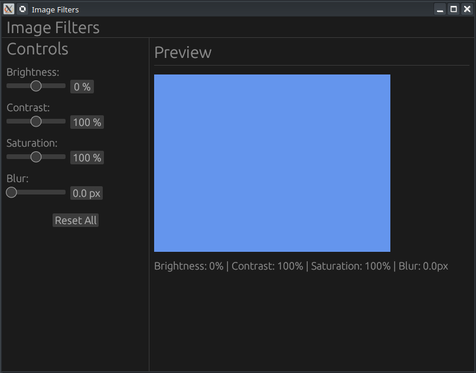

# 🎨 Projet : Filtres d'Image avec egui (Rust)

[Build Image Filters with egui Sliders | Rust GUI Tutorial #14 - YouTube](https://www.youtube.com/watch?v=3TsJewyDwpY)



Ce projet enseigne comment créer une application de réglage de filtres d'image (luminosité, contraste, saturation, flou) en utilisant des **Sliders** dans le framework **egui**.

## 🎥 Résumé de la Vidéo

La vidéo détaille la création d'une interface de contrôle en temps réel où le déplacement des curseurs modifie dynamiquement un rectangle de couleur servant de prévisualisation.

### Points Clés de l'Interface
- **`egui::Slider`** : Utilisation de `Slider::new` pour lier une valeur mutable (`f32`) à une plage numérique.
- **Personnalisation** : Ajout de suffixes comme `%` ou `px` pour clarifier les unités des réglages.
- **Panneaux (Layout)** :
    - `SidePanel` à gauche pour les contrôles.
    - `CentralPanel` pour l'affichage du résultat.
- **Bouton de réinitialisation** : Utilisation de `*self = MyApp::default()` pour remettre instantanément tous les curseurs à leurs valeurs d'origine.

### Logique de calcul des couleurs
L'application applique des formules mathématiques simples sur les canaux RGB (Rouge, Vert, Bleu) :
1.  **Luminosité** : Ajout d'une valeur à chaque canal.
2.  **Contraste** : Mise à l'échelle des canaux par rapport à un point médian (128).
3.  **Saturation** : Mélange entre la couleur calculée et sa version en niveaux de gris.
4.  **Clamp** : Utilisation de `.clamp(0.0, 255.0)` pour s'assurer que les valeurs restent dans les limites valides du format RGB.

---

## 💻 Structure du Code Rust

Le code est principalement réparti entre le modèle de données (`struct`) et l'implémentation de l'interface utilisateur.

### 1. Structure des données (`app.rs`)
| Paramètre    | Type  | Valeur par défaut | Rôle                                |
| :----------- | :---- | :---------------- | :---------------------------------- |
| `brightness` | `f32` | `0.0`             | Ajuste la clarté (-100 à +100%).    |
| `contrast`   | `f32` | `100.0`           | Ajuste l'écart entre les couleurs.  |
| `saturation` | `f32` | `100.0`           | Ajuste l'intensité des couleurs.    |
| `blur`       | `f32` | `0.0`             | Simule un rayon de flou (0 à 20px). |

### 2. Fonctions Principales
- **`preview_color(&self) -> Color32`** : Calcule la couleur finale en appliquant les filtres sur une couleur de base (bleuet/cornflower blue).
- **`ui.allocate_exact_size()`** : Réserve un espace fixe (400x300 pixels) dans l'interface pour le dessin.
- **`ui.painter().rect_filled()`** : Dessine le rectangle avec la couleur calculée en temps réel.

### 3. Exemple de code (Extrait GitHub)

**Création d'un slider dans l'UI**

```rust
ui.label("Contrast:");
ui.add(egui::Slider::new(&mut self.contrast, 0.0..=200.0).suffix(" %"));
```

**Dessin de la prévisualisation**

```rust
let color = self.preview_color();
let (rect, _) = ui.allocate_exact_size(egui::vec2(400.0, 300.0), egui::Sense::hover());
ui.painter().rect_filled(rect, 0.0, color);
```

---

## 🛠️ Configuration du Projet (`Cargo.toml`)
Le projet utilise la version la plus récente de la bibliothèque au moment du tutoriel :
- **Dépendance** : `eframe = "0.31"`
- **Environnement** : Développé sous **Neovim** avec l'explorateur de fichiers **Neo-tree**.

**Conclusion :** Ce tutoriel est une excellente introduction à la manipulation de données numériques via des widgets interactifs et au dessin direct sur le "Canvas" de l'UI avec egui.