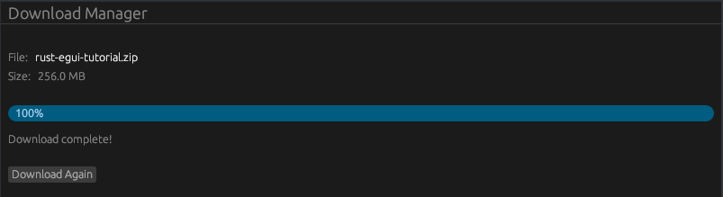

# 📜 Projet : Animated Progress Bar (Download Manager)



Ce tutoriel (épisode 15 de la série "Learn egui in Neovim") explique comment implémenter et animer une barre de progression pour simuler un téléchargement de fichier.

## 🎥 Résumé de la Vidéo

La vidéo se concentre sur l'utilisation du widget `ProgressBar` et sur la gestion d'une animation fluide pilotée par l'état de l'application.

### Points Clés de l'Interface
- **Barre de Progression** : Utilisation de `egui::ProgressBar::new(valeur)` où la valeur va de `0.0` à `1.0`.
- **Animation** : L'utilisation de `.animate(true)` ajoute un effet visuel sur la barre lorsqu'elle est active (progress < 1).
- **Feedback Visuel** : Affichage du pourcentage textuel à l'intérieur de la barre avec `.show_percentage()`.
- **Rendu Continu** : L'utilisation de `ctx.request_repaint()` est cruciale pour forcer egui à redessiner l'interface à chaque frame, créant ainsi une animation fluide du remplissage.

### Logique d'État (State-Driven UI)
L'interface change dynamiquement selon la progression :
1.  **En attente** : Bouton "Start Download".
2.  **En cours** : Bouton "Cancel" et barre animée.
3.  **Terminé** : Bouton "Download Again" et texte de statut "Download Complete".

---

## 💻 Structure du Code Rust

Le code est organisé pour séparer la configuration de la fenêtre (`main.rs`) de la logique de l'interface (`app.rs`).


### 1. Modèle de Données (`app.rs`)
La structure principale gère l'état interne du téléchargement :

| Champ            | Type     | Description                                        |
| :--------------- | :------- | :------------------------------------------------- |
| `file_name`      | `String` | Nom du fichier (ex: "archive.zip").                |
| `size`           | `f32`    | Taille simulée du fichier en MB.                   |
| `progress`       | `f32`    | Valeur entre 0.0 et 1.0 représentant l'avancement. |
| `is_downloading` | `bool`   | Flag pour savoir si l'incrémentation est active.   |


### 2. Logique de Mise à Jour (`update`)
Dans la fonction `update`, le code suit ces étapes :
- **Incrémentation** : Si `is_downloading` est vrai, `progress` augmente de `0.005` par frame jusqu'à atteindre `1.0`.
- **Repaint** : Appel à `ctx.request_repaint()` tant que le téléchargement n'est pas fini pour maintenir l'animation.
- **Construction de l'UI** :
    - `TopBottomPanel` : Affiche le titre de l'application.
    - `CentralPanel` : Affiche les informations du fichier, la `ProgressBar` configurée, et les boutons conditionnels.


### 3. Exemple de Widget Progress Bar
```rust
ui.add(
    egui::ProgressBar::new(self.progress)
        .show_percentage()
        .animate(self.is_downloading)
);
```

---

**Conclusion :** Ce projet démontre comment transformer une interface statique en une application réactive et animée en utilisant simplement les méthodes natives de `egui` et la gestion de la boucle de rendu (`request_repaint`).