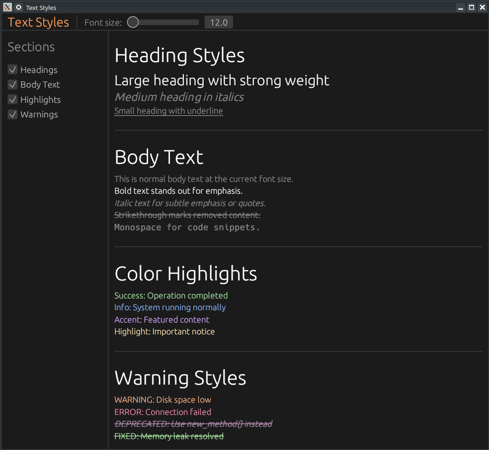

# 🎨 Personnalisation des Styles de Texte avec egui

[GitHub - GoCelesteAI/egui_text_styles: Episode 16: Rich Text — Learn egui in Neovim series · GitHub](https://github.com/GoCelesteAI/egui_text_styles)



Ce tutoriel explique comment modifier l'apparence du texte (police, taille, famille) de manière globale dans une application egui, en manipulant les structures `Style` et `FontDefinitions`.

## 🎥 Résumé de la Vidéo

La vidéo démontre que par défaut, egui propose un ensemble restreint de styles de texte (`Heading`, `Body`, `Monospace`, etc.). L'objectif est d'apprendre à surcharger ces styles ou à en créer de nouveaux.

### Points clés abordés :
- **La hiérarchie des styles** : Comprendre comment egui utilise les `TextStyles` pour mapper une intention (ex: afficher un titre) à une police et une taille spécifique.
- **Accès au Contexte (`ctx`)** : Utilisation de `ctx.set_style()` pour appliquer les changements à l'ensemble de l'interface utilisateur.
- **Familles de polices** : Distinction entre `Proportional` (largeur variable, type sans-serif) et `Monospace` (largeur fixe).
- **Visualisation immédiate** : Le développeur montre comment les changements de code impactent instantanément le rendu de l'UI dans Neovim.

---

## 💻 Analyse du Code Rust

Le code du dépôt `egui_text_styles` illustre comment configurer ces styles au démarrage de l'application.

### 1. Configuration des `TextStyles`
Le cœur du code consiste à définir un objet `Style` et à modifier son champ `text_styles`.

| Style de Texte | Famille de Police | Taille (Pixels) |
| :------------- | :---------------- | :-------------- |
| **Heading**    | Proportional      | 35.0            |
| **Body**       | Proportional      | 20.0            |
| **Monospace**  | Monospace         | 16.0            |
| **Button**     | Proportional      | 18.0            |
| **Small**      | Proportional      | 12.0            |

### 2. Implémentation technique
Dans la closure de configuration de `eframe`, le code procède comme suit :

1.  **Récupération du style actuel** : On commence par copier le style par défaut via `let mut style = (*ctx.style()).clone();`.
2.  **Surcharge des styles** :
    ```rust
    style.text_styles = [
        (TextStyle::Heading, FontId::new(35.0, FontFamily::Proportional)),
        (TextStyle::Body, FontId::new(20.0, FontFamily::Proportional)),
        // ... autres styles
    ].into();
    ```
3.  **Application** : On réinjecte le style modifié dans le contexte avec `ctx.set_style(style);`.


### 3. Utilisation dans l'UI
Une fois configurés, ces styles s'appliquent automatiquement aux widgets standards :
- `ui.heading("Texte")` utilisera la nouvelle taille de 35.0.
- `ui.label("Texte")` utilisera le style `Body` (20.0).

---

## 🏗️ Structure du Projet

- **`main.rs`** : Contient la logique d'initialisation de `eframe`.
- **Variables mutables** : L'utilisation de `mut style` est cruciale car la structure `Style` d'egui contient de nombreux champs (espacement, couleurs, etc.) que l'on ne souhaite pas redéfinir manuellement, d'où l'importance du `.clone()`.

### Pourquoi est-ce utile ?
Cette approche est indispensable pour l'accessibilité (agrandir les polices pour les écrans haute résolution) ou pour respecter une charte graphique spécifique sans avoir à spécifier la taille manuellement sur chaque widget `Label`.