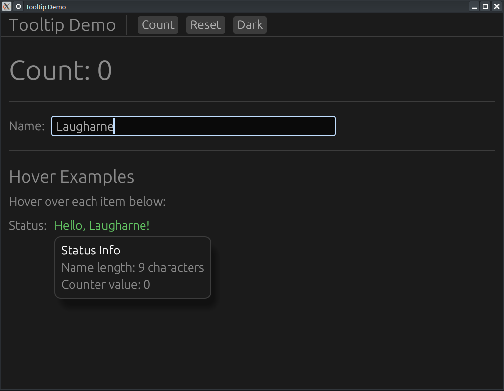

# 💡 Projet : Maîtriser les Tooltips avec egui

[Rust egui Tutorial #18: Tooltips — Add Hover Hints to Any Widget - YouTube](https://www.youtube.com/watch?v=L7XI70kxkvw)



Ce tutoriel (épisode 18) explique comment enrichir l'expérience utilisateur en ajoutant des indices textuels ou visuels qui apparaissent au survol des widgets.

---

## 🎥 Résumé de la Vidéo

L'objectif est d'apprendre à attacher des informations contextuelles à n'importe quel élément de l'interface (boutons, labels, champs de texte).

### Les 3 types de Tooltips présentés :
1.  **`on_hover_text`** : Affiche une simple chaîne de caractères dans une petite bulle noire classique [[03:01](http://www.youtube.com/watch?v=L7XI70kxkvw&t=181)].
2.  **`on_hover_ui`** : Permet de créer un tooltip personnalisé contenant n'importe quel widget (titres, images, plusieurs lignes de texte) [[03:15](http://www.youtube.com/watch?v=L7XI70kxkvw&t=195)].
3.  **`on_hover_ui_at_pointer`** : Similaire au précédent, mais la bulle d'aide suit précisément le curseur de la souris au lieu d'être fixée par rapport au widget [[05:07](http://www.youtube.com/watch?v=L7XI70kxkvw&t=307)].

### Fonctionnalités secondaires :
- **Gestion du thème** : Implémentation d'un bouton pour basculer entre le mode clair (Light) et le mode sombre (Dark) via `ctx.set_visuals` [[03:51](http://www.youtube.com/watch?v=L7XI70kxkvw&t=231)].
- **Dynamisme** : Les tooltips peuvent afficher des données en temps réel (par exemple, la longueur d'une chaîne de caractères saisie) [[06:21](http://www.youtube.com/watch?v=L7XI70kxkvw&t=381)].

---

## 🏗️ Structure du Code (GitHub)

Le code est organisé de manière modulaire pour séparer le lancement de l'application de sa logique interne.

### 1. Organisation des fichiers
| Fichier   | Rôle                                                                                                                           |
| :-------- | :----------------------------------------------------------------------------------------------------------------------------- |
| `main.rs` | Initialise la fenêtre (1024x768) et lance la boucle d'application [[01:43](http://www.youtube.com/watch?v=L7XI70kxkvw&t=103)]. |
| `app.rs`  | Contient la structure `MyApp` et toute la logique de rendu de l'interface.                                                     |

### 2. La structure de données (`app.rs`)
La structure `MyApp` gère l'état global utilisé dans les tooltips :
- `count: i32` : Un compteur incrémenté par un bouton.
- `name: String` : Le texte saisi par l'utilisateur.
- `is_dark_mode: bool` : L'état du thème sélectionné.

### 3. Implémentation technique
Les tooltips sont ajoutés par **chaînage de méthodes** sur la réponse d'un widget :

```rust
// Exemple de texte simple
ui.button("Incrémenter")
  .on_hover_text("Cliquer pour ajouter 1 au compteur");

// Exemple d'interface riche (Rich Tooltip)
ui.label("Statut")
  .on_hover_ui(|ui| {
      ui.heading("Détails du système");
      ui.label(format!("Valeur actuelle : {}", self.count));
  });
```

---

## 🛠️ Points techniques clés

- **Réactivité** : Les méthodes `.on_hover_...` sont appelées immédiatement après la définition du widget. Elles ne s'exécutent que si `egui` détecte que la souris survole l'élément [[08:42](http://www.youtube.com/watch?v=L7XI70kxkvw&t=522)].
- **Formatage** : Utilisation de `RichText` à l'intérieur des tooltips pour modifier la taille ou la couleur du texte d'aide [[05:33](http://www.youtube.com/watch?v=L7XI70kxkvw&t=333)].
- **Contextualisation** : Le tutoriel montre comment afficher la longueur du nom saisi uniquement lorsque l'on survole le champ de texte, évitant ainsi d'encombrer l'interface principale [[08:03](http://www.youtube.com/watch?v=L7XI70kxkvw&t=483)].


**Conclusion :** Ce projet démontre que les tooltips dans **egui** sont extrêmement flexibles. Ils ne se limitent pas à du texte brut mais peuvent devenir de mini-interfaces dynamiques permettant de garder l'écran principal épuré tout en fournissant une aide précieuse à l'utilisateur.

