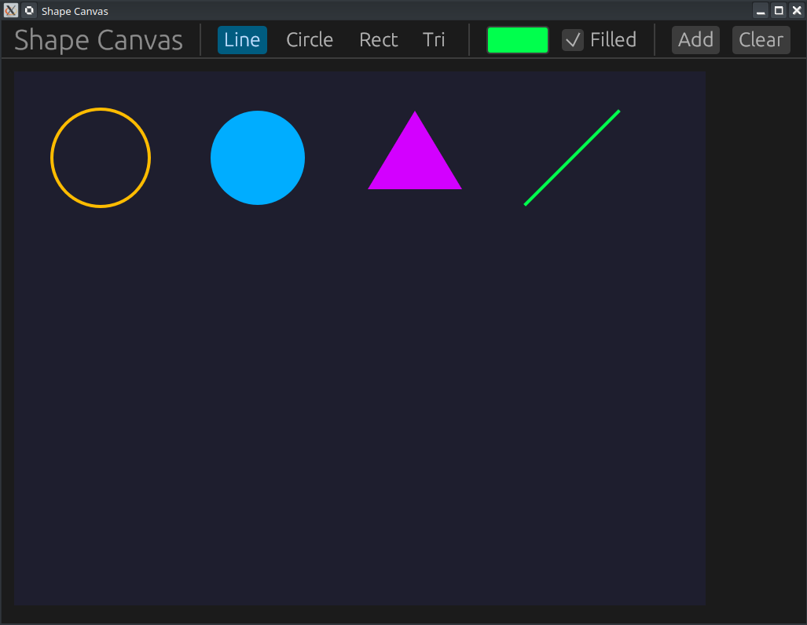

# 🎨 Projet : Custom Painting (Dessin de formes) avec egui

[Rust egui Tutorial #19: Custom Painting — Draw Shapes with the Painter API - YouTube](https://www.youtube.com/watch?v=04vN6doZz-4)



Ce tutoriel (épisode 19) explique comment utiliser l'API **Painter** de `egui` pour dessiner des formes géométriques personnalisées (lignes, cercles, rectangles, triangles) sur un canevas interactif.

---

## 🎥 Résumé de la Vidéo

L'objectif est de construire une application de dessin où l'utilisateur peut choisir une forme, une couleur, et l'ajouter à une grille sur un canevas dédié.

### Concepts Clés abordés :
- **L'API Painter** : Accédée via `ui.painter()`, c'est l'outil principal pour dessiner des primitives en dehors des widgets standards [[08:38](http://www.youtube.com/watch?v=04vN6doZz-4&t=518)].
- **Allocation d'espace** : Utilisation de `ui.allocate_exact_size()` pour réserver une zone spécifique dans l'interface utilisateur pour le dessin [[04:23](http://www.youtube.com/watch?v=04vN6doZz-4&t=263)].
- **Système de coordonnées** : Utilisation de `Pos2` (positions 2D) et `Vec2` (vecteurs de taille) pour placer les formes avec précision [[05:05](http://www.youtube.com/watch?v=04vN6doZz-4&t=305)].

### Méthodes de dessin utilisées :
| Forme         | Méthode Painter                   | Paramètres principaux                                                                                             |
| :------------ | :-------------------------------- | :---------------------------------------------------------------------------------------------------------------- |
| **Ligne**     | `line_segment`                    | Deux points `Pos2` et un `Stroke` (épaisseur/couleur) [[00:30](http://www.youtube.com/watch?v=04vN6doZz-4&t=30)]. |
| **Cercle**    | `circle_filled` / `circle_stroke` | Centre, rayon et couleur/trait [[00:37](http://www.youtube.com/watch?v=04vN6doZz-4&t=37)].                        |
| **Rectangle** | `rect_filled` / `rect_stroke`     | Objet `Rect` (défini par centre et taille) [[00:44](http://www.youtube.com/watch?v=04vN6doZz-4&t=44)].            |
| **Triangle**  | `add(Shape::convex_polygon)`      | Vecteur de 3 points `Pos2` [[00:50](http://www.youtube.com/watch?v=04vN6doZz-4&t=50)].                            |

---

## 💻 Structure du Code (GitHub)

Le code est organisé pour séparer la gestion des données de la logique de rendu.

### 1. Modélisation des données (`app.rs`)
Le code définit trois structures essentielles :
- **`ShapeKind` (Enum)** : Définit les types de formes disponibles (Line, Circle, Rect, Triangle).
  ```rust
  enum ShapeKind {
      Line,
      Circle,
      Rectangle,
      Triangle,
  }
  ```
- **`DrawnShape` (Struct)** : Stocke les propriétés d'une forme spécifique (type, couleur, remplissage).
  ```rust
    struct DrawnShape {
      kind  : ShapeKind,
      color : egui::Color32,
      filled: bool,
    }
  ```
- **`MyApp` (Struct)** : L'état global contenant la liste des formes (`Vec<DrawnShape>`), la forme actuellement sélectionnée et la couleur choisie [[02:35](http://www.youtube.com/watch?v=04vN6doZz-4&t=155)].
  ```rust
    pub struct MyApp {
        shape : ShapeKind,
        color : [f32; 3],
        filled: bool,
        shapes: Vec<DrawnShape>,
    }
  ```

### 2. Interface Utilisateur (UI)
- **Panneau Supérieur (`TopBottomPanel`)** : Contient les contrôles pour sélectionner le type de forme, un bouton `ColorEditButton` pour la couleur, et un bouton "Add" pour pousser une nouvelle forme dans le vecteur [[03:07](http://www.youtube.com/watch?v=04vN6doZz-4&t=187)].
- **Panneau Central (`CentralPanel`)** :
    1.  Réserve l'espace via `allocate_exact_size`.
    2.  Boucle sur le vecteur `shapes`.
    3.  Calcule la position de chaque forme sur une grille dynamique [[04:43](http://www.youtube.com/watch?v=04vN6doZz-4&t=283)].
    4.  Appelle les fonctions du `painter` pour le rendu.


---

## 🏗️ Détails de l'Architecture Technique

### Le flux de rendu (Render Loop)
Le projet illustre parfaitement le mode "Immediate Mode" de `egui` :
1.  **Interaction** : L'utilisateur change la couleur ou ajoute une forme.
2.  **Mise à jour de l'état** : Le `Vec<DrawnShape>` est modifié.
3.  **Redessin complet** : À chaque frame (60 fois par seconde), `egui` parcourt toute la liste et demande au `painter` de redessiner chaque primitive géométrique.

### Dépendances (`Cargo.toml`)
```toml
[dependencies]
eframe = "0.31" # Framework principal pour la fenêtre et l'UI
```

---

## 🔗 Liens et Timestamps Utiles
- [[02:13](http://www.youtube.com/watch?v=04vN6doZz-4&t=133)] - Définition de l'énumération des types de formes.
- [[03:37](http://www.youtube.com/watch?v=04vN6doZz-4&t=217)] - Implémentation du sélecteur de couleur natif.
- [[05:05](http://www.youtube.com/watch?v=04vN6doZz-4&t=305)] - Logique mathématique pour dessiner une ligne entre deux points.
- [[06:05](http://www.youtube.com/watch?v=04vN6doZz-4&t=365)] - Utilisation des polygones convexes pour créer des triangles personnalisés.
- [[08:22](http://www.youtube.com/watch?v=04vN6doZz-4&t=502)] - Fonctionnalité de réinitialisation (Clear) du canevas.


**Conclusion** : Ce code est une excellente base pour quiconque souhaite créer des outils de diagrammes, des éditeurs de graphiques simples ou des visualisations de données personnalisées en Rust.

