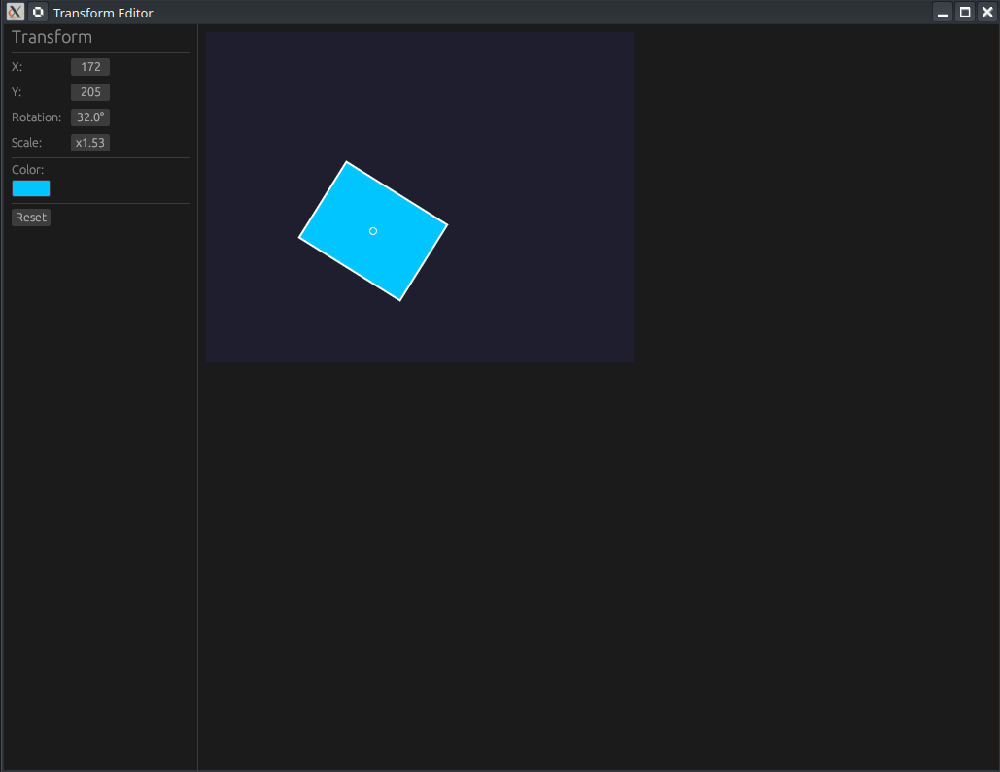

# 🎚️ Projet : Transform Editor (egui Drag Values)

[egui Drag Values: Speed, Range & Formatting | Rust GUI Ep 20 - YouTube](https://www.youtube.com/watch?v=2I2kWHbeFAw)



Cet épisode (n°20) enseigne comment utiliser le widget `DragValue` pour créer des contrôles numériques interactifs permettant de manipuler une forme géométrique sur un canevas.

---

## 🎥 Résumé de la Vidéo

L'application construite est un éditeur de transformations. Elle permet de modifier la position, la rotation et l'échelle d'un rectangle soit via des champs numériques glissables (DragValues), soit par interaction directe sur le canevas.

### Concepts Clés des DragValues
- **`DragValue::new()`** : Crée un champ numérique où l'on peut cliquer et faire glisser la souris pour changer la valeur [[00:17](http://www.youtube.com/watch?v=2I2kWHbeFAw&t=17)].
- **`.speed()`** : Ajuste la sensibilité du glissement (à quelle vitesse la valeur change) [[00:30](http://www.youtube.com/watch?v=2I2kWHbeFAw&t=30)].
- **`.range()`** : Limite la valeur entre une borne minimale et maximale [[00:37](http://www.youtube.com/watch?v=2I2kWHbeFAw&t=37)].
- **`.prefix()` / `.suffix()`** : Ajoute des labels contextuels comme "°" ou "x" directement dans le champ [[00:44](http://www.youtube.com/watch?v=2I2kWHbeFAw&t=44)].

### Interaction avec le Canevas
- **Déplacement** : Clic gauche et glisser sur le canevas pour changer les coordonnées X/Y [[05:09](http://www.youtube.com/watch?v=2I2kWHbeFAw&t=309)].
- **Rotation** : Clic droit et glisser pour faire pivoter la forme [[05:21](http://www.youtube.com/watch?v=2I2kWHbeFAw&t=321)].
- **Échelle** : Utilisation de la molette de la souris pour zoomer/dézoomer [[05:33](http://www.youtube.com/watch?v=2I2kWHbeFAw&t=333)].

---

## 💻 Structure du Code (GitHub)

Le code est réparti entre `main.rs` et `app.rs`.

### 1. Organisation des fichiers
- **`main.rs`** : Configure la fenêtre native avec `eframe` et lance l'application [[01:27](http://www.youtube.com/watch?v=2I2kWHbeFAw&t=87)].
- **`app.rs`** : Contient la structure `TransformEditor` et toute la logique de rendu.

### 2. La structure `TransformEditor`
Elle gère l'état complet de la forme :
| Champ      | Type      | Description                     |
| :--------- | :-------- | :------------------------------ |
| `pos`      | `Pos2`    | Position (X, Y) sur le canevas. |
| `rotation` | `f32`     | Angle en degrés.                |
| `scale`    | `f32`     | Facteur de taille.              |
| `color`    | `Color32` | Couleur de remplissage.         |

### 3. Implémentation du Widget DragValue
Dans le panneau latéral (`SidePanel`), les contrôles sont organisés dans une grille (`Grid`) :
```rust
// Exemple pour la rotation
ui.add(egui::DragValue::new(&mut self.rotation)
    .speed(0.5)
    .suffix("°")
);
```


---

## 🏗️ Structure Technique et Rendu

### Le Canevas Central
Le `CentralPanel` n'utilise pas de widgets standards mais dessine directement sur l'écran :
1.  **Allocation** : On réserve l'espace avec `ui.allocate_rect`.
2.  **Calcul des points** : Les coins du rectangle sont calculés mathématiquement à l'aide de sinus et cosinus pour gérer la rotation [[06:33](http://www.youtube.com/watch?v=2I2kWHbeFAw&t=393)].
3.  **Peinture (Painting)** :
    - `convex_polygon` : Pour remplir la forme avec la couleur choisie [[07:05](http://www.youtube.com/watch?v=2I2kWHbeFAw&t=425)].
    - `closed_line` : Pour dessiner le contour blanc [[07:17](http://www.youtube.com/watch?v=2I2kWHbeFAw&t=437)].
    - `circle` : Pour marquer le point d'origine (le centre) de la forme [[07:29](http://www.youtube.com/watch?v=2I2kWHbeFAw&t=449)].


### Outils de développement mentionnés
Le tutoriel montre l'utilisation de **Neovim** avec le plugin **Neo-tree** pour naviguer dans les fichiers et gérer les divisions d'écran (splits) afin de voir le code et les changements simultanément [[08:41](http://www.youtube.com/watch?v=2I2kWHbeFAw&t=521)].

---

**Conclusion** : Les `DragValue` sont des alternatives compactes et intuitives aux sliders traditionnels, particulièrement utiles dans les outils de création ou les éditeurs de propriétés où l'espace est limité.

