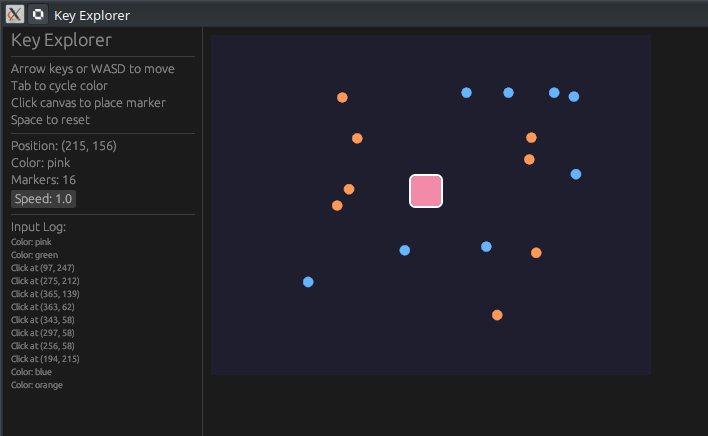

# ⌨️ Projet : egui Key Explorer (Entrées Clavier & Souris)

[egui Keyboard Input: Arrow Keys, Clicks & Events | Rust GUI Ep 21 - YouTube](https://www.youtube.com/watch?v=u2b_AJtpB6c)

Ce projet démontre comment capturer les événements utilisateur (touches pressées, clics de souris) pour déplacer un objet sur un canvas et interagir avec l'interface.

---

## 🎥 Résumé de la Vidéo

L'objectif est de créer un "explorateur de touches" où un curseur carré se déplace sur un canvas en fonction des entrées du clavier, tout en réagissant aux clics de souris.

### Concepts Clés abordés :
- **`ctx.input(|i| ...)`** : La méthode principale pour lire l'état des périphériques à chaque frame [[02:03](http://www.youtube.com/watch?v=u2b_AJtpB6c&t=123)].
- **Gestion du Clavier** :
    - `key_pressed(Key::ArrowUp)` : Détecte si une touche vient d'être pressée pour déplacer le curseur [[03:25](http://www.youtube.com/watch?v=u2b_AJtpB6c&t=205)].
    - Touches spéciales : Utilisation de **Tab** pour cycler entre les couleurs et **Espace** pour enregistrer la position dans un log [[04:05](http://www.youtube.com/watch?v=u2b_AJtpB6c&t=245)].
- **Interaction Souris** :
    - Utilisation de `sense(Sense::click())` sur une zone allouée pour détecter les clics [[06:25](http://www.youtube.com/watch?v=u2b_AJtpB6c&t=385)].
    - Récupération des coordonnées exactes du clic via `interact_pointer_pos()` [[06:33](http://www.youtube.com/watch?v=u2b_AJtpB6c&t=393)].
- **Peinture (Painter)** : Dessiner des formes personnalisées (cercles pour les marqueurs de clics, rectangle pour le curseur) sur le canvas [[07:07](http://www.youtube.com/watch?v=u2b_AJtpB6c&t=427)].

---

## 💻 Structure du Code (GitHub)

Le code est réparti entre la configuration de la fenêtre et la logique applicative.

### 1. Organisation des fichiers
| Fichier   | Rôle                                                                                                                                                 |
| :-------- | :--------------------------------------------------------------------------------------------------------------------------------------------------- |
| `main.rs` | Initialise la fenêtre native avec `eframe::run_native` et définit la taille du viewport [[01:43](http://www.youtube.com/watch?v=u2b_AJtpB6c&t=103)]. |
| `app.rs`  | Contient la structure `MyApp`, les constantes de couleurs et la logique de rendu `update`.                                                           |

### 2. La structure `MyApp`
Elle maintient l'état persistant de l'application :
- `pos`: `Pos2` (coordonnées X, Y du curseur).
- `color_index`: `usize` (index de la couleur actuelle dans le tableau de constantes).
- `log`: `Vec<String>` (historique des actions effectuées).
- `markers`: `Vec<Pos2>` (liste des points où l'utilisateur a cliqué).

### 3. Logique d'Interaction (dans `update`)

Le flux de contrôle suit cet ordre précis dans le code :

1.  **Capture des entrées** : Un bloc `ctx.input` vérifie les touches directionnelles et met à jour `self.pos`.
2.  **Panneau Latéral (Side Panel)** : Affiche les coordonnées en temps réel, la couleur sélectionnée et les 10 dernières entrées du log [[05:09](http://www.youtube.com/watch?v=u2b_AJtpB6c&t=309)].
3.  **Zone Centrale (Central Panel)** :
    - Alloue un espace de dessin.
    - Si un clic est détecté, la position du curseur `self.pos` est téléportée aux coordonnées de la souris.
    - Le `Painter` dessine le fond, puis les marqueurs de clics précédents, et enfin le curseur principal.

---

## 🛠️ Fonctions Utiles de egui

| Fonction                | Description                                                                      | Timestamp                                                   |
| :---------------------- | :------------------------------------------------------------------------------- | :---------------------------------------------------------- |
| `ui.allocate_rect`      | Réserve un espace spécifique sur l'écran pour dessiner.                          | [[06:11](http://www.youtube.com/watch?v=u2b_AJtpB6c&t=371)] |
| `ui.painter()`          | Récupère l'objet permettant de dessiner des formes (lignes, cercles, etc.).      | [[07:07](http://www.youtube.com/watch?v=u2b_AJtpB6c&t=427)] |
| `rect.center_mount`     | Calcule les coins d'un rectangle à partir d'un point central.                    | [[07:43](http://www.youtube.com/watch?v=u2b_AJtpB6c&t=463)] |
| `ctx.request_repaint()` | Force egui à redessiner immédiatement (essentiel pour la réactivité du clavier). | [[03:09](http://www.youtube.com/watch?v=u2b_AJtpB6c&t=189)] |

### Conclusion technique
Le code montre une séparation nette entre la **détection** (`ctx.input`) et le **rendu** (`painter`). L'utilisation de `Default` pour `MyApp` permet d'initialiser proprement le curseur au centre de l'écran lors du lancement.

