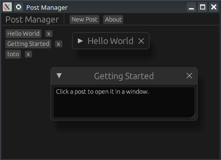

# 🪟 Projet : Post Manager (Fenêtres & Popups)

[egui Floating Windows & Dialogs | Rust GUI Ep 22 - YouTube](http://www.youtube.com/watch?v=jLHCzam2Mco)



Ce tutoriel (épisode 22) explique comment créer une interface de gestion de publications utilisant des fenêtres flottantes, des formulaires de création et des dialogues de confirmation.

---

## 🎥 Résumé de la Vidéo

L'application permet de lister des messages, d'en créer de nouveaux via une fenêtre dédiée, et de gérer des fenêtres de prévisualisation indépendantes.

### Concepts Clés abordés :
- **`egui::Window::new`** : La méthode de base pour créer une fenêtre flottante au-dessus du panneau central [[00:23](http://www.youtube.com/watch?v=jLHCzam2Mco&t=23)].
- **Contrôle de visibilité (`.open()`)** : Utilisation d'un booléen mutable pour afficher ou masquer une fenêtre [[00:30](http://www.youtube.com/watch?v=jLHCzam2Mco&t=30)].
- **Comportement des fenêtres** :
    - `.resizable(bool)` : Autorise ou non le redimensionnement [[00:37](http://www.youtube.com/watch?v=jLHCzam2Mco&t=37)].
    - `.collapsible(bool)` : Permet de réduire la fenêtre à sa barre de titre [[09:05](http://www.youtube.com/watch?v=jLHCzam2Mco&t=545)].
    - `.anchor()` : Fixe la fenêtre à une position précise de l'écran (ex: centre pour un dialogue) [[00:44](http://www.youtube.com/watch?v=jLHCzam2Mco&t=44)].
- **Dialogues de confirmation** : Création d'une fenêtre modale ancrée au centre pour confirmer une action critique comme la suppression [[06:05](http://www.youtube.com/watch?v=jLHCzam2Mco&t=365)].

---

## 💻 Structure du Code (GitHub)

Le code est organisé autour d'une structure de données centrale qui gère l'état de l'interface.

### 1. Organisation des Fichiers
Le projet est divisé en deux fichiers principaux :
- **`main.rs`** : Initialise l'application native avec `eframe::run_native` [[01:39](http://www.youtube.com/watch?v=jLHCzam2Mco&t=99)].
- **`app.rs`** : Contient toute la logique de l'interface et les structures de données.

### 2. Modèle de Données
Le code définit une structure `Post` et l'état global de l'application :

| Élément        | Rôle                                                                                                                     |
| :------------- | :----------------------------------------------------------------------------------------------------------------------- |
| `struct Post`  | Contient `title` et `body` (le contenu du message).                                                                      |
| `struct MyApp` | Stocke la liste `posts: Vec<Post>`, l'index de suppression et les booléens de visibilité (`show_new_post_window`, etc.). |

Cette structure `MyApp` est le cœur de l'application : elle représente ce qu'on appelle la **Source de Vérité** (Single Source of Truth). Dans un framework de GUI en mode immédiat comme **egui**, l'interface est reconstruite à chaque frame (60 fois par seconde) en se basant uniquement sur ces données.

```rust
pub struct MyApp {
    posts         : Vec<Post>,
    open_posts    : Vec<bool>,
    new_title     : String,
    new_body      : String,
    show_new_post : bool,
    confirm_delete: Option<usize>,
    show_about    : bool,
}
```

#### Gestion du Contenu Principal
- **`posts: Vec<Post>`** : Le stockage des données réelles. C'est ici que sont conservés les titres et les corps des messages.
- **`open_posts: Vec<bool>`** : Ce vecteur de booléens est synchronisé avec la liste des posts. Chaque `bool` détermine si la fenêtre de lecture spécifique à un post est actuellement affichée ou non.

#### État du Formulaire de Création
- **`new_title` & `new_body`** : Ces chaînes de caractères (Strings) servent de "tampons" (buffers). Lorsque vous tapez dans un champ de texte `TextEdit`, **egui** modifie directement ces variables.
- **`show_new_post: bool`** : Un simple interrupteur. S'il est à `true`, la fenêtre flottante contenant le formulaire de création apparaît.

#### Logique de Dialogue et Métadonnées
- **`confirm_delete: Option<usize>`** : C'est la gestion intelligente de la suppression.
    - Si la valeur est `None`, le popup de confirmation est caché.
    - Si elle contient `Some(index)`, le popup s'affiche et l'application sait exactement quel post supprimer si l'utilisateur clique sur "Confirmer".
- **`show_about: bool`** : Gère l'affichage de la fenêtre d'information sur l'application.


#### Pourquoi cette structure est-elle efficace ?
Cette organisation permet de séparer la **vue** de la **donnée**. Par exemple, au lieu de supprimer un post immédiatement (ce qui pourrait être une erreur), on stocke l'intention de supprimer dans `confirm_delete`. Cela permet à **egui** de dessiner un dialogue de confirmation de manière conditionnelle :

```rust
if let Some(index) = self.confirm_delete {
    egui::Window::new("Confirmer ?").show(ctx, |ui| {
        if ui.button("Oui").clicked() {
            self.posts.remove(index);
            self.confirm_delete = None;
        }
    });
}
```

Cette approche "Pilotée par l'État" (State-Driven) rend le code très prévisible et facile à déboguer.

### 3. Logique des Fenêtres
Le code utilise des boucles pour générer dynamiquement des fenêtres :
- **Fenêtres de lecture** : Une boucle `for` parcourt les messages et crée une `Window` pour chaque message dont l'affichage est activé [[04:25](http://www.youtube.com/watch?v=jLHCzam2Mco&t=265)].
- **Ancrage du Dialogue** : Pour le "Confirm Delete", le code utilise `.anchor(egui::Align2::CENTER_CENTER, [0.0, 0.0])` pour s'assurer que le popup apparaît au milieu de l'écran [[06:21](http://www.youtube.com/watch?v=jLHCzam2Mco&t=381)].

---

## 🏗️ Détails Techniques du Code

### Dépendances (`Cargo.toml`)
Le projet repose sur une seule dépendance majeure :
```toml
[dependencies]
eframe = "0.31"
```

### Points d'intérêt dans l'implémentation
- **Interaction de fermeture** : La méthode `.open(&mut bool)` ajoute automatiquement un bouton "X" dans le coin de la fenêtre qui bascule la valeur du booléen à `false` lorsqu'on clique dessus [[08:57](http://www.youtube.com/watch?v=jLHCzam2Mco&t=537)].
- **Ajout de données** : Dans la fenêtre "New Post", le bouton "Publish" utilise `self.posts.push(...)` pour mettre à jour la liste principale, ce qui rafraîchit immédiatement l'interface [[05:41](http://www.youtube.com/watch?v=jLHCzam2Mco&t=341)].
- **Gestion des ID** : Chaque fenêtre flottante doit avoir un titre unique (ou un ID spécifique) pour que **egui** puisse suivre son état (position, taille) d'une frame à l'autre [[04:33](http://www.youtube.com/watch?v=jLHCzam2Mco&t=273)].

---

## 🛠️ Résumé des fonctionnalités par module

- **Toolbar (`TopBottomPanel`)** : Boutons pour ouvrir le formulaire de création et la fenêtre "À propos" [[03:28](http://www.youtube.com/watch?v=jLHCzam2Mco&t=208)].
- **Liste (`CentralPanel`)** : Affiche les titres des posts avec des boutons "View" (ouvre une fenêtre) et "Delete" (ouvre le dialogue) [[03:53](http://www.youtube.com/watch?v=jLHCzam2Mco&t=233)].
- **Fenêtres flottantes** : Contiennent des `TextEdit` pour visualiser ou éditer le contenu [[04:51](http://www.youtube.com/watch?v=jLHCzam2Mco&t=291)].

**Conclusion :** Ce code démontre la puissance du mode "Immédiat" d'egui : les fenêtres sont déclarées conditionnellement dans la boucle d'update, ce qui simplifie énormément la gestion des popups par rapport aux frameworks traditionnels.
