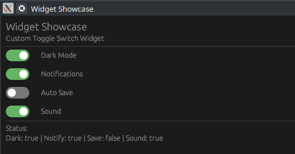

# 🛠️ Projet : egui Custom Widgets (Toggle Switch)

[Toggle Switch Widget Tutorial](https://www.youtube.com/watch?v=HKjI8_VsS5g)



Ce tutoriel (épisode 25) enseigne comment aller au-delà des widgets standards d'egui en implémentant le trait `Widget` pour créer des composants réutilisables et esthétiques, comme un interrupteur (Toggle Switch).

---

## 🎥 Résumé de la Vidéo

L'objectif est de construire un widget "Toggle" **personnalisé** et **réutilisable** qui remplace la checkbox standard par un interrupteur coulissant moderne.

### Concepts Clés abordés :
- **Implémentation du trait `Widget`** : Apprendre à définir la méthode `ui(self, ui: &mut Ui) -> Response` pour rendre n'importe quelle structure de données affichable en tant que widget.
- **Réservation d'espace (`allocate_exact_size`)** : Comment demander à egui une zone précise de l'écran pour dessiner son widget.
- **Interactivité (`Sense::click()`)** : Faire en sorte que le widget réagisse aux clics de l'utilisateur pour basculer son état.
- **Peinture personnalisée (`Painter API`)** : Utiliser des primitives comme `rect_filled` pour le fond et `circle_filled` pour le bouton coulissant.

---

## 💻 Structure du Code (GitHub)

Le code est structuré pour favoriser la réutilisation du widget dans différents contextes (Paramètres, Barre de statut, etc.).


### 1. Organisation des Fichiers
| Fichier     | Rôle                                                                                 |
| :---------- | :----------------------------------------------------------------------------------- |
| `main.rs`   | Point d'entrée déclarant les modules `app` et `toggle`.                              |
| `toggle.rs` | Contient la logique interne du widget (la structure `Toggle` et son implémentation). |
| `app.rs`    | L'application de démonstration qui utilise plusieurs fois le widget `Toggle`.        |


### 2. Le Widget `Toggle` (`toggle.rs`)
La structure `Toggle` utilise des **paramètres de durée de vie (lifetimes)** car elle maintient une référence mutable vers le booléen qu'elle doit modifier.

```rust
pub struct Toggle<'a> {
    value: &'a mut bool, // Référence au booléen à basculer
    label: &'a str,      // Référence au label (texte) à afficher à droite du switch
}
```


### 3. Logique de Dessin (Painting)
Le rendu visuel s'adapte dynamiquement à l'état du booléen :
- **Couleur** : Vert si `on` est vrai, gris sinon.
- **Position du bouton** : À droite si `on` est vrai, à gauche sinon.
- **Animation** : Bien que simple ici, la position est calculée dynamiquement dans la fonction `ui`.

---

## 🛠️ Utilisation et Rendu

### Intégration dans l'UI
Pour utiliser le widget personnalisé, on utilise la méthode `ui.add()` :
```rust
ui.add(Toggle::new(&mut self.dark_mode));
```

### Timestamps Clés de la Vidéo :
- **[00:12]** : Aperçu de l'application finale avec plusieurs interrupteurs fonctionnels.
- **[02:01]** : Explication de la structure `Toggle` avec sa référence mutable.
- **[02:44]** : Début de l'implémentation du trait `egui::Widget`.
- **[03:14]** : Utilisation de `allocate_exact_size` pour définir les dimensions du switch (40x20 pixels).
- **[03:44]** : Détails sur l'utilisation du `Painter` pour dessiner les formes géométriques.


**Conclusion :** Créer ses propres widgets avec `impl Widget` est la méthode la plus puissante pour personnaliser l'apparence de ses applications Rust. Cela permet de transformer n'importe quelle logique de dessin complexe en un composant simple à utiliser d'une seule ligne de code.

