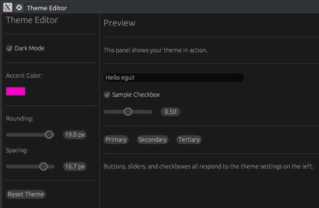

# 🎨 Projet : Éditeur de Thème (Theming & Styles)

[egui Theming: Custom Colors, Rounding & Spacing | Rust GUI Ep 26 - YouTube](http://www.youtube.com/watch?v=v_TWUeWu7UQ)

Ce tutoriel (épisode 26 de la série) enseigne comment manipuler l'apparence globale d'une application **egui** en modifiant les couleurs, les arrondis (rounding) et l'espacement (spacing) en temps réel.

---

## 🎥 Résumé de la Vidéo

L'objectif est de construire un "Theme Editor" qui permet de prévisualiser instantanément les changements de style sur différents widgets.

### Concepts Clés abordés :
- **Visuals** : Gère les schémas de couleurs (modes sombre et clair) et les couleurs d'accentuation.
- **Style** : Définit les propriétés de mise en page globales comme l'arrondi des coins et l'espacement entre les widgets.
- **Application du Thème** : Utilisation de `ctx.set_visuals()` et `ctx.set_style()` pour mettre à jour l'interface à chaque frame.
- **Color32** : Structure utilisée pour définir des couleurs personnalisées à partir de valeurs RGB.

---

## 💻 Structure du Code (GitHub)

Le code est organisé pour séparer la gestion de l'état du thème de l'affichage de la prévisualisation.

### 1. Organisation des Fichiers
| Fichier   | Rôle                                                                         |
| :-------- | :--------------------------------------------------------------------------- |
| `main.rs` | Point d'entrée et configuration de la fenêtre native.                        |
| `app.rs`  | Contient la structure `ThemeEditor` et la logique de mise à jour des styles. |

### 2. La structure `ThemeEditor`
Elle stocke les variables qui contrôlent l'apparence :
- `dark_mode: bool` : Bascule entre le thème sombre et clair.
- `accent_color: [f32; 3]` : Stocke les composantes RGB pour la couleur de sélection.
- `rounding: f32` : Contrôle la courbure des coins des boutons et fenêtres.
- `spacing: f32` : Définit l'espace entre les éléments de l'UI.

### 3. Logique de mise à jour (`fn update`)
À chaque frame, l'application effectue les étapes suivantes :
1.  **Configuration des Visuals** : Crée un objet `Visuals` (sombre ou clair) et modifie sa propriété `selection.bg_fill` avec la couleur d'accentuation choisie.
2.  **Configuration du Style** : Clone le style actuel du contexte, modifie `spacing.item_spacing` et `visuals.widgets.xxx.rounding`, puis réapplique le style modifié via `ctx.set_style()`.

---

## 🛠️ Fonctionnalités de l'Éditeur

L'interface est divisée en deux panneaux distincts :

### Panneau de Contrôle (Side Panel)
- **Checkbox** : Pour basculer le mode sombre [[04:23](http://www.youtube.com/watch?v=v_TWUeWu7UQ&t=263)].
- **Color Picker** : Pour choisir une couleur d'accentuation personnalisée [[04:33](http://www.youtube.com/watch?v=v_TWUeWu7UQ&t=273)].
- **Sliders** : Pour ajuster finement les arrondis [[04:43](http://www.youtube.com/watch?v=v_TWUeWu7UQ&t=283)] et l'espacement [[04:53](http://www.youtube.com/watch?v=v_TWUeWu7UQ&t=293)].
- **Bouton Reset** : Pour restaurer instantanément les valeurs par défaut [[05:04](http://www.youtube.com/watch?v=v_TWUeWu7UQ&t=304)].

### Zone de Prévisualisation (Central Panel)
Affiche divers widgets (boutons, labels, cases à cocher) pour voir l'impact direct du thème sur l'interface utilisateur [[05:19](http://www.youtube.com/watch?v=v_TWUeWu7UQ&t=319)].

---

## 🔗 Liens et Timestamps Clés
- **[[00:23](http://www.youtube.com/watch?v=v_TWUeWu7UQ&t=23)]** : Présentation des contrôles de `Visuals`.
- **[[00:30](http://www.youtube.com/watch?v=v_TWUeWu7UQ&t=30)]** : Explication de l'ajustement global du `Style`.
- **[[03:35](http://www.youtube.com/watch?v=v_TWUeWu7UQ&t=215)]** : Technique pour cloner et muter le style de l'application.
- **[[07:01](http://www.youtube.com/watch?v=v_TWUeWu7UQ&t=421)]** : Démonstration du passage du mode clair au mode sombre.
- **[[07:21](http://www.youtube.com/watch?v=v_TWUeWu7UQ&t=441)]** : Effet visuel de l'ajustement des arrondis sur les boutons.

**Conclusion :** Ce projet démontre la flexibilité d'**egui** : contrairement à d'autres frameworks où le style est statique, ici le thème fait partie intégrante de l'état de l'application et peut être modifié dynamiquement avec un impact immédiat sur tous les widgets.
