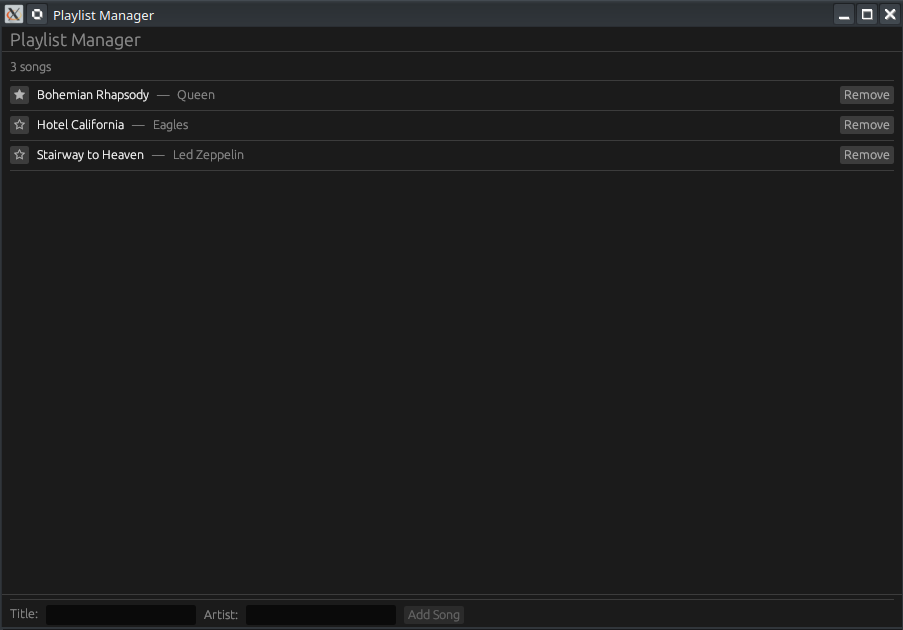

# 🎵 Projet : Gestionnaire de Playlist (Playlist Manager)

[Build a Playlist Manager with egui — Vec State & CRUD | Rust GUI Ep 27 - YouTube](http://www.youtube.com/watch?v=fAwag7WMnG4)




Ce tutoriel (épisode 27) montre comment créer une application complète de type CRUD (Créer, Lire, Mettre à jour, Supprimer) en utilisant des vecteurs de structures pour gérer l'état de l'application.

---

## 🎥 Résumé de la Vidéo

L'objectif est de construire une interface permettant d'ajouter des morceaux à une liste, de les marquer comme favoris et de les supprimer, le tout dans une zone défilante.

### Points Clés du Développement :
- **Gestion d'état avec `Vec`** : Utilisation d'un vecteur de structures `Song` pour stocker la liste des morceaux.
- **Validation d'entrée** : Le bouton "Ajouter" est désactivé (`add_enabled`) tant que les champs "Titre" et "Artiste" ne sont pas remplis.
- **Zone de défilement** : Utilisation de `ScrollArea` pour permettre la navigation dans une longue liste de chansons.
- **Suppression différée** : Pour éviter les conflits d'emprunt (borrow conflicts) lors de l'itération sur la liste, la suppression est stockée dans une variable temporaire et exécutée après la boucle.

---

## 💻 Structure du Code (GitHub)

L'application est décomposée en structures claires pour séparer les données de l'interface.

### 1. Modèles de Données (`app.rs`)
| Structure   | Champs                                   | Rôle                                               |
| :---------- | :--------------------------------------- | :------------------------------------------------- |
| **`Song`**  | `title`, `artist`, `favorite` (bool)     | Représente une piste individuelle.                 |
| **`MyApp`** | `songs` (Vec), `new_title`, `new_artist` | État global de l'application et tampons de saisie. |

### 2. Organisation de l'Interface
- **TopPanel** : Affiche le titre de l'application.
- **BottomPanel** : Contient le formulaire d'ajout avec deux champs `TextEdit` de largeur fixe et le bouton de validation.
- **CentralPanel** : Affiche la liste des chansons avec un bouton "Étoile" pour les favoris et un bouton "Supprimer" aligné à droite.

---

## 🛠️ Fonctionnalités et Logique

### Ajout d'une chanson
Le bouton "Add Song" utilise la logique suivante :
```rust
// Si les champs ne sont pas vides, on pousse dans le vecteur
if ui.add_enabled(!self.new_title.is_empty() && !self.new_artist.is_empty(), egui::Button::new("Add")).clicked() {
    self.songs.push(Song { ... });
    self.new_title.clear();
    self.new_artist.clear();
}
```


### Suppression (Deferred Removal)
Pour supprimer un élément en toute sécurité pendant une itération `for` :
1. On crée une variable `let mut to_remove = None;`.
2. Si le bouton supprimer est cliqué : `to_remove = Some(index);`.
3. Après la boucle : `if let Some(i) = to_remove { self.songs.remove(i); }`.

---

## 🔗 Liens et Timestamps Clés
- **[[00:13](http://www.youtube.com/watch?v=fAwag7WMnG4&t=13)]** : Aperçu de l'application terminée (Preview).
- **[[02:23](http://www.youtube.com/watch?v=fAwag7WMnG4&t=143)]** : Définition de la structure `Song`.
- **[[05:18](http://www.youtube.com/watch?v=fAwag7WMnG4&t=318)]** : Construction du formulaire d'ajout dans le panneau du bas.
- **[[07:02](http://www.youtube.com/watch?v=fAwag7WMnG4&t=422)]** : Implémentation de la `ScrollArea` et du bouton favoris.
- **[[07:58](http://www.youtube.com/watch?v=fAwag7WMnG4&t=478)]** : Explication de la logique de suppression différée.
- **[[09:25](http://www.youtube.com/watch?v=fAwag7WMnG4&t=565)]** : Démonstration finale du CRUD en action.

**Conclusion :** Ce projet est une excellente base pour comprendre comment egui gère des listes dynamiques de données complexes et comment structurer une application Rust interactive avec des contrôles de saisie robustes.
