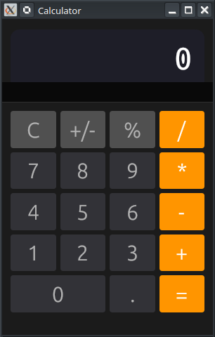

# 🧮 Projet : Calculatrice avec egui (Grid Layout & Logic)

[Calculator App in Rust egui — Grid Layout & Operator Logic | Learn egui Ep28 - YouTube](https://www.youtube.com/watch?v=hrFHcQXxGbs)

Ce tutoriel explique comment concevoir une calculatrice dotée d'une interface élégante, utilisant un système de grille pour les boutons et une machine à états pour la logique arithmétique.

---

## 🎥 Résumé de la Vidéo

L'objectif est de construire une application capable de gérer les opérations de base, les décimales, les pourcentages, l'inversion de signe et les erreurs de division par zéro.

### Concepts Clés abordés :
- **Machine à états (State Machine)** : Suivi de l'opérande précédent, de l'opérateur choisi et de l'état de l'affichage.
- **Layout en Grille** : Organisation des boutons en colonnes et lignes avec des tailles dynamiques.
- **Stylisation avancée** : Utilisation de `Color32` pour colorer les opérateurs en orange et les chiffres en gris.
- **Traitement des données** : Conversion des chaînes de caractères (`String`) en nombres flottants (`f64`) pour les calculs.

---

## 💻 Structure du Code

L'application repose sur une structure `MyApp` qui gère à la fois les données et le comportement de la calculatrice.

### 1. Structure de données (`app.rs`)
La structure contient les éléments essentiels pour le calcul :
- `display`: La chaîne de caractères actuellement affichée à l'écran.
- `first_operand`: Le premier nombre saisi (stocké pour l'opération).
- `operator`: L'opération en cours (Addition, Soustraction, etc.).
- `waiting_for_next`: Un indicateur pour savoir si le prochain chiffre doit remplacer l'affichage actuel.

### 2. Logique Arithmétique
Le code utilise des méthodes d'aide pour simplifier la gestion des clics :
- `press_digit(n)` : Ajoute un chiffre à l'affichage.
- `press_operator(op)` : Évalue l'opération précédente si nécessaire et enregistre le nouvel opérateur.
- `evaluate()` : Exécute le calcul réel via un `match` sur l'opérateur et met à jour l'affichage.

---

## 🎨 Interface Utilisateur (UI)

L'interface est découpée en deux zones principales :

| Zone        | Composant egui   | Rôle                                                      |
| :---------- | :--------------- | :-------------------------------------------------------- |
| **Écran**   | `TopBottomPanel` | Affiche le texte en police monospace, aligné à droite.    |
| **Clavier** | `CentralPanel`   | Grille de boutons stylisés avec des couleurs spécifiques. |

### Boutons Spéciaux
- **Bouton Zéro** : Ce bouton est configuré pour occuper **deux colonnes**, contrairement aux autres qui n'en occupent qu'une.
- **Couleurs** : Les opérateurs (`/`, `*`, `-`, `+`, `=`) utilisent un fond orange (`Color32::from_rgb(255, 159, 10)`) pour une meilleure ergonomie.

---

## 🔗 Liens et Timestamps Clés

- **[00:12](https://www.youtube.com/watch?v=hrFHcQXxGbs&t=12s)** : **Présentation du résultat final** – Démonstration de l'interface et des calculs en action.
- **[02:30](https://www.youtube.com/watch?v=hrFHcQXxGbs&t=150s)** : **Structure MyApp** – Mise en place des champs pour l'affichage (`display`), les opérandes et l'opérateur.
- **[03:30](https://www.youtube.com/watch?v=hrFHcQXxGbs&t=210s)** : **Valeurs par défaut** – Initialisation de l'affichage à "0" au démarrage.
- **[06:00](https://www.youtube.com/watch?v=hrFHcQXxGbs&t=360s)** : **Logique `evaluate`** – Implémentation du moteur de calcul (addition, soustraction, multiplication, division).
- **[09:00](https://www.youtube.com/watch?v=hrFHcQXxGbs&t=540s)** : **Panneau d'affichage** – Utilisation de `TopBottomPanel` pour créer l'écran de la calculatrice.
- **[11:00](https://www.youtube.com/watch?v=hrFHcQXxGbs&t=660s)** : **Couleurs des boutons** – Application des couleurs orange pour les opérateurs et grise pour les chiffres, avec `Color32` et `fill`.
- **[12:00](https://www.youtube.com/watch?v=hrFHcQXxGbs&t=720s)** : **Bouton "0" large** – Technique pour qu'un bouton s'étende sur deux colonnes de la grille.
- **[16:00](https://www.youtube.com/watch?v=hrFHcQXxGbs&t=960s)** : **Démonstration complète** – Test des opérations complexes, des pourcentages et de la gestion d'erreur de division par zéro.

**Conclusion :** Ce projet illustre parfaitement comment combiner les widgets d'**egui** avec une logique de programmation rigoureuse pour créer un outil utilitaire classique.