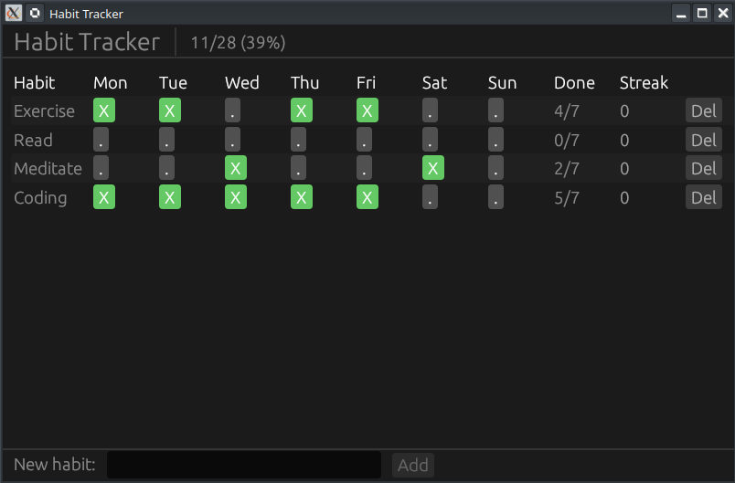

# 📅 Projet : Habit Tracker (Suivi d'habitudes)

[Habit Tracker App in Rust egui — Grid, Checkboxes & CRUD | Learn egui Ep29 - YouTube](http://www.youtube.com/watch?v=H6V9UfM0ypU)

Cette application permet de gérer des habitudes hebdomadaires via une grille interactive, de calculer des séries (streaks) et de manipuler les données (Ajout/Suppression).

-----

## 🎥 Résumé de la Vidéo

L'application repose sur une grille où chaque ligne représente une habitude et chaque colonne un jour de la semaine.

### Concepts Clés abordés :

  - **Grille avec lignes alternées (`striped`)** : Améliore la lisibilité visuelle de la grille [[05:55](http://www.youtube.com/watch?v=H6V9UfM0ypU&t=355)].
  - **Gestion d'état par tableaux de booléens** : Chaque habitude possède un tableau `[bool; 7]` pour suivre l'état de chaque jour [[02:45](http://www.youtube.com/watch?v=H6V9UfM0ypU&t=165)].
  - **Calcul des "Streaks"** : Utilisation d'itérateurs inversés pour compter les jours consécutifs complétés en partant de la fin [[03:03](http://www.youtube.com/watch?v=H6V9UfM0ypU&t=183)].
  - **Suppression différée (Deferred Removal)** : Technique pour supprimer un élément d'une liste sans créer de conflits d'emprunt (borrow conflicts) pendant l'itération de la boucle UI [[05:50](http://www.youtube.com/watch?v=H6V9UfM0ypU&t=350)].

-----

## 💻 Structure du Code

Le projet est structuré autour de deux entités principales : la structure `Habit` et l'application globale `HabitTrackerApp`.

### 1. Modèle de données (`app.rs`)

Une habitude est définie de la manière suivante :

  - **`name`** : String (nom de l'habitude).
  - **`days`** : `[bool; 7]` (état coché ou non pour la semaine).

### 2. Logique métier

| Fonctionnalité   | Description                                                                                                                                                    |
| :--------------- | :------------------------------------------------------------------------------------------------------------------------------------------------------------- |
| **Ajout**        | Un champ texte en bas permet d'ajouter une habitude. Le bouton est désactivé si le champ est vide [[05:05](http://www.youtube.com/watch?v=H6V9UfM0ypU&t=305)]. |
| **Toggle**       | Cliquer sur un jour change la couleur du bouton (Vert si complété) et met à jour les stats [[07:00](http://www.youtube.com/watch?v=H6V9UfM0ypU&t=420)].        |
| **Statistiques** | Calcul du pourcentage de complétion global affiché dans le panneau supérieur [[04:30](http://www.youtube.com/watch?v=H6V9UfM0ypU&t=270)].                      |

-----

## 🏗️ Architecture de l'Interface (UI)

L'interface utilise les panneaux standards d'egui pour organiser l'espace :

  - **`TopBottomPanel` (Haut)** : Titre et barre de progression de la semaine [[04:20](http://www.youtube.com/watch?v=H6V9UfM0ypU&t=260)].
  - **`CentralPanel`** : La grille principale (`egui::Grid`) contenant les noms des habitudes, les 7 cases à cocher, le compteur de série et le bouton de suppression [[05:40](http://www.youtube.com/watch?v=H6V9UfM0ypU&t=340)].
  - **`TopBottomPanel` (Bas)** : Formulaire d'ajout de nouvelle habitude [[04:55](http://www.youtube.com/watch?v=H6V9UfM0ypU&t=295)].

-----

## 🔗 Navigation dans la Vidéo (Timestamps)

  - **[[00:13]](http://www.youtube.com/watch?v=H6V9UfM0ypU&t=13)** : Présentation de l'application finale.
  - **[[02:45]](http://www.youtube.com/watch?v=H6V9UfM0ypU&t=165)** : Définition de la structure `Habit` et du tableau de booléens.
  - **[[03:03]](http://www.youtube.com/watch?v=H6V9UfM0ypU&t=183)** : Explication de l'algorithme de calcul de la "série" (streak).
  - **[[05:55]](http://www.youtube.com/watch?v=H6V9UfM0ypU&t=355)** : Configuration de la grille egui avec l'option `striped`.
  - **[[08:20]](http://www.youtube.com/watch?v=H6V9UfM0ypU&t=500)** : Mise en œuvre de la **suppression différée** pour éviter les crashs.
  - **[[10:22]](http://www.youtube.com/watch?v=H6V9UfM0ypU&t=622)** : Démonstration pratique : ajout d'habitudes et suivi des progrès.

**Conclusion :** Ce projet est un excellent exercice pour maîtriser les grilles complexes dans **egui** et apprendre à gérer des mutations de listes (`Vec`) de manière sécurisée en Rust au sein d'une interface utilisateur.

