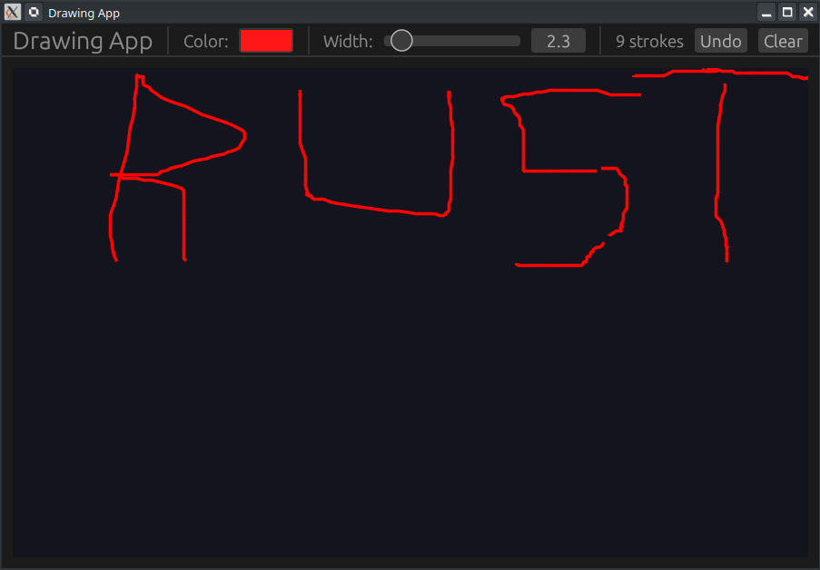

# 🎨 Projet : Application de Dessin avec egui (Painter & Undo)

[Drawing App in Rust egui — Painter, Strokes & Undo | Learn egui Ep30 - YouTube](http://www.youtube.com/watch?v=kWE0pkah0QI)

Ce tutoriel explique comment transformer une interface **egui** en une toile interactive permettant le dessin à main levée, la gestion des couleurs, de l'épaisseur des traits et une fonctionnalité d'annulation (Undo).

-----

## 🎥 Résumé de la Vidéo

L'application repose sur l'utilisation du `Painter`, un outil bas niveau d'egui qui permet de dessiner des formes géométriques directement sur l'écran.

### Concepts Clés abordés :

  - **Allocate Painter** : Réserver une zone spécifique de l'interface comme "canevas" interactif [[04:47](http://www.youtube.com/watch?v=kWE0pkah0QI&t=287)].
  - **Gestion des entrées (Sense)** : Configurer le canevas pour détecter le clic et le glissement de la souris [[10:44](http://www.youtube.com/watch?v=kWE0pkah0QI&t=644)].
  - **Structure de données des traits** : Stocker chaque trait comme une liste de points avec sa propre couleur et épaisseur pour permettre l'effacement sélectif [[02:40](http://www.youtube.com/watch?v=kWE0pkah0QI&t=160)].
  - **Algorithme de tracé** : Utiliser `windows(2)` pour relier les points consécutifs par des segments de ligne [[06:25](http://www.youtube.com/watch?v=kWE0pkah0QI&t=385)].

-----

## 💻 Structure du Code

Le projet est principalement contenu dans `app.rs` et utilise une logique de stockage de vecteurs.

### 1. Modèle de Données

  - **`struct Stroke`** : Contient un `Vec<Pos2>` (les points), une `Color32` (la couleur) et un `f32` (l'épaisseur).
  - **`struct MyApp`** :
      - `all_strokes: Vec<Stroke>` : L'historique complet des dessins.
      - `current_stroke: Vec<Pos2>` : Le trait en cours de tracé pendant que la souris est enfoncée.
      - `color` et `width` : Les paramètres actuels sélectionnés dans la barre d'outils.

### 2. Logique de Dessin

Le dessin se fait en deux étapes :

1.  **Capture** : Pendant le glissement (`dragged`), les coordonnées de la souris sont ajoutées à `current_stroke`.
2.  **Stockage** : Relâcher la souris transfère les points de `current_stroke` vers `all_strokes`.
3.  **Rendu** : À chaque frame, l'application parcourt `all_strokes` et dessine chaque segment.

-----

## 🛠️ Fonctionnalités et Interface

| Élément          | Fonction                                             | Timestamp                                                   |
| :--------------- | :--------------------------------------------------- | :---------------------------------------------------------- |
| **Color Picker** | Choisir la couleur du trait via un bouton d'édition. | [[03:50]](http://www.youtube.com/watch?v=kWE0pkah0QI&t=230) |
| **Slider**       | Ajuster l'épaisseur du pinceau.                      | [[04:00]](http://www.youtube.com/watch?v=kWE0pkah0QI&t=240) |
| **Bouton Undo**  | Supprime le dernier trait ajouté au vecteur (`pop`). | [[04:10]](http://www.youtube.com/watch?v=kWE0pkah0QI&t=250) |
| **Bouton Clear** | Vide entièrement le vecteur de traits.               | [[04:25]](http://www.youtube.com/watch?v=kWE0pkah0QI&t=265) |

-----

## 🔗 Liens et Navigation (Timestamps)

  - **[[00:13]](http://www.youtube.com/watch?v=kWE0pkah0QI&t=13)** : Présentation de l'application de dessin terminée.
  - **[[02:40]](http://www.youtube.com/watch?v=kWE0pkah0QI&t=160)** : Explication de la structure `Stroke` (points, couleur, épaisseur).
  - **[[04:47]](http://www.youtube.com/watch?v=kWE0pkah0QI&t=287)** : Allocation du `Painter` et détection du clic/drag.
  - **[[06:25]](http://www.youtube.com/watch?v=kWE0pkah0QI&t=385)** : Technique de rendu des segments de ligne avec `windows(2)`.
  - **[[09:53]](http://www.youtube.com/watch?v=kWE0pkah0QI&t=593)** : Démonstration du dessin libre et changement de couleur.
  - **[[10:13]](http://www.youtube.com/watch?v=kWE0pkah0QI&t=613)** : Test de la fonctionnalité **Undo** (annulation).

**Conclusion :** Cette application démontre comment **egui** permet de descendre à un niveau de rendu plus bas (le Painter) pour créer des outils créatifs personnalisés tout en gardant une interface de contrôle très simple.

