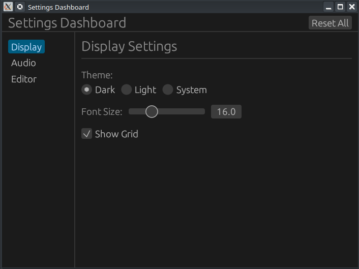

# ⚙️ Projet : Tableau de Bord de Paramètres avec Onglets et Persistance

[Rust egui Settings Dashboard — Tabbed Panels & Persistence | Ep31 - YouTube](https://www.youtube.com/watch?v=lbN9ncuAV7g)



Ce tutoriel explique comment construire une interface de configuration robuste utilisant des onglets pour naviguer entre les catégories (Affichage, Audio, Éditeur) et un système de sauvegarde automatique.

-----

## 🎥 Résumé de la Vidéo

L'application permet de modifier divers réglages (thème, volume, taille de police) qui sont conservés même après la fermeture de l'application grâce à la bibliothèque **serde**.

### Concepts Clés abordés :

  - **Navigation par onglets** : Utilisation d'un `SidePanel` et de `selectable_value` pour changer de vue.
  - **Persistance des données** : Sauvegarde et chargement automatique des réglages via `eframe::get_value` et `set_value`.
  - **Structure de données centralisée** : Utilisation d'une struct `Settings` regroupant tous les champs configurables.
  - **Réinitialisation** : Implémentation d'un bouton "Reset All" utilisant la valeur par défaut (`Default::default()`) de la structure.

-----

## 💻 Structure du Code associé

Le code est organisé pour séparer la définition des données de la logique d'affichage.

### 1. Modèle de Données (`app.rs`)

La structure `Settings` est le cœur de l'application. Elle dérive `Serialize` et `Deserialize` pour permettre la sauvegarde sur disque.

```rust
#[derive(serde::Serialize, serde::Deserialize, Clone)]
pub struct Settings {
    pub theme:         Theme,
    pub font_size:     f32,
    pub volume:        f32,
    pub notifications: bool,
    // ... autres champs
}
```

### 2. Gestion des Onglets

Un `enum Tab` définit les différentes sections disponibles :

  - **Display** (Affichage) : Thème (Sombre/Clair), taille de police, grille.
  - **Audio** : Volume (avec curseur %), notifications.
  - **Editor** (Éditeur) : Taille des tabulations, retour à la ligne automatique.

### 3. Dépendances nécessaires (`Cargo.toml`)

Il est crucial d'activer les "features" spécifiques pour que la persistance fonctionne :

```toml
[dependencies]
eframe = { version = "0.31", features = ["persistence"] }
serde  = { version = "1", features = ["derive"] }
```
-----

## 🛠️ Fonctionnalités et Interface

| Composant UI      | Usage dans le projet                                                  |
| :---------------- | :-------------------------------------------------------------------- |
| **`SidePanel`**   | Contient les boutons de navigation (onglets).                         |
| **`radio_value`** | Sélection exclusive du thème (Dark, Light, System).                   |
| **`Slider`**      | Contrôle précis de la taille de police, du volume et des tabulations. |
| **`Checkbox`**    | Toggles pour les notifications, le son ou l'auto-save.                |

-----

## 🔗 Liens et Timestamps Clés (YouTube)

  - **[00:12](https://www.youtube.com/watch?v=lbN9ncuAV7g&t=12s)** : **Aperçu final** – Démonstration des onglets et de la persistance.
  - **[02:10](https://www.youtube.com/watch?v=lbN9ncuAV7g&t=130s)** : **Structure Settings** – Définition des réglages et de l'enum Theme.
  - **[04:10](https://www.youtube.com/watch?v=lbN9ncuAV7g&t=250s)** : **Chargement (Persistence)** – Récupération des données sauvegardées via le stockage local.
  - **[05:20](https://www.youtube.com/watch?v=lbN9ncuAV7g&t=320s)** : **Bouton Reset All** – Comment réinitialiser tous les champs instantanément.
  - **[07:10](https://www.youtube.com/watch?v=lbN9ncuAV7g&t=430s)** : **Paramètres d'Affichage** – Implémentation des boutons radio et du slider de police.
  - **[10:50](https://www.youtube.com/watch?v=lbN9ncuAV7g&t=650s)** : **Démo en direct** – Changement de volume et de thème avec vérification après redémarrage.

**Conclusion :** Ce projet est une excellente base pour n'importe quelle application desktop en Rust, car il montre comment gérer proprement les préférences utilisateur de manière organisée et persistante.