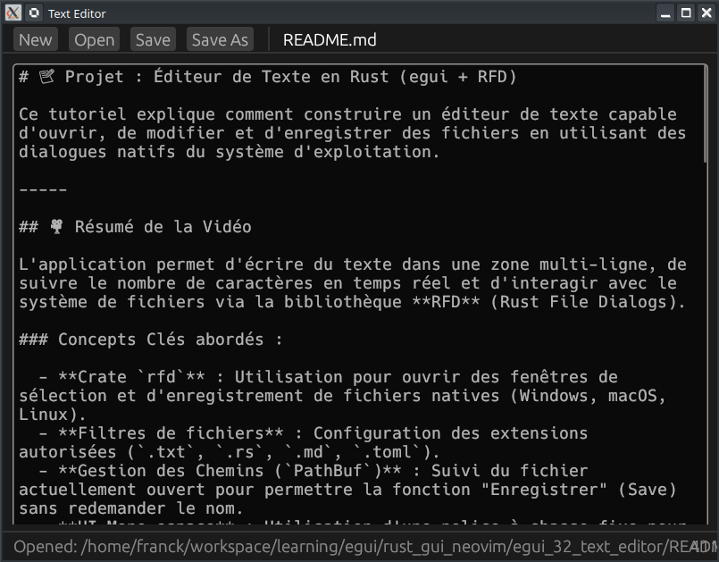

# 📝 Projet : Éditeur de Texte en Rust (egui + RFD)

[Text Editor in Rust egui — Open, Save & File Dialogs | Learn egui Ep32 - YouTube](https://www.youtube.com/watch?v=xPteQOxyZhc)



Ce tutoriel explique comment construire un éditeur de texte capable d'ouvrir, de modifier et d'enregistrer des fichiers en utilisant des dialogues natifs du système d'exploitation.

-----

## 🎥 Résumé de la Vidéo

L'application permet d'écrire du texte dans une zone multi-ligne, de suivre le nombre de caractères en temps réel et d'interagir avec le système de fichiers via la bibliothèque **RFD** (Rust File Dialogs).

### Concepts Clés abordés :

  - **Crate `rfd`** : Utilisation pour ouvrir des fenêtres de sélection et d'enregistrement de fichiers natives (Windows, macOS, Linux).
  - **Filtres de fichiers** : Configuration des extensions autorisées (`.txt`, `.rs`, `.md`, `.toml`).
  - **Gestion des Chemins (`PathBuf`)** : Suivi du fichier actuellement ouvert pour permettre la fonction "Enregistrer" (Save) sans redemander le nom.
  - **UI Mono-espace** : Utilisation d'une police à chasse fixe pour la zone d'édition, idéale pour le code.

### Dépendances (`Cargo.toml`)

```toml
[dependencies]
eframe = "0.31"
rfd = "0.15"
```

-----

## 💻 Structure du Code

L'application repose sur une structure `MyApp` qui gère le contenu textuel et l'état du fichier.

### 1. Structure de données (`app.rs`)

```rust
pub struct MyApp {
    content:   String,          // Texte saisi par l'utilisateur
    file_path: Option<PathBuf>, // Chemin du fichier (None si nouveau)
    status:    String,          // Message d'état (ex: "Fichier enregistré")
}
```

### 2. Opérations sur les fichiers

Le code implémente quatre méthodes fondamentales :

  - **`open_file()`** : Ouvre le sélecteur, lit le contenu via `fs::read_to_string` et met à jour l'éditeur.
  - **`save_file()`** : Écrit directement dans le chemin existant. Si aucun chemin n'existe, elle appelle `save_file_as()`.
  - **`save_file_as()`** : Ouvre un dialogue d'enregistrement pour choisir un nouvel emplacement.
  - **`new_file()`** : Réinitialise le contenu et le chemin (équivalent à "Nouveau document").

-----

## 🎨 Organisation de l'Interface (UI)

L'interface est découpée en trois panneaux :

| Zone               | Composant egui            | Fonctionnalité                                                     |
| :----------------- | :------------------------ | :----------------------------------------------------------------- |
| **Barre d'outils** | `TopBottomPanel` (Top)    | Boutons Nouveau, Ouvrir, Sauvegarder, Enregistrer sous.            |
| **Zone d'édition** | `CentralPanel`            | `TextEdit::multiline` dans une `ScrollArea` avec police monospace. |
| **Barre d'état**   | `TopBottomPanel` (Bottom) | Affiche le statut actuel et le compteur de caractères.             |

-----

## 🔗 Liens et Timestamps Clés (YouTube)

  - **[00:12](https://www.youtube.com/watch?v=xPteQOxyZhc&t=12s)** : **Aperçu du projet** – Démonstration de l'ouverture et de la sauvegarde d'un fichier.
  - **[02:10](https://www.youtube.com/watch?v=xPteQOxyZhc&t=130s)** : **Structure `MyApp`** – Explication de l'utilisation de `Option<PathBuf>` pour l'état du fichier.
  - **[03:20](https://www.youtube.com/watch?v=xPteQOxyZhc&t=200s)** : **Logique d'ouverture** – Utilisation de `FileDialog::new().pick_file()`.
  - **[04:20](https://www.youtube.com/watch?v=xPteQOxyZhc&t=260s)** : **Logique de sauvegarde** – Différence entre "Save" et "Save As".
  - **[07:00](https://www.youtube.com/watch?v=xPteQOxyZhc&t=420s)** : **Barre d'état** – Affichage dynamique du nom du fichier et du nombre de caractères.
  - **[07:40](https://www.youtube.com/watch?v=xPteQOxyZhc&t=460s)** : **Éditeur multi-ligne** – Configuration de la zone de texte avec défilement et police monospace.
  - **[09:50](https://www.youtube.com/watch?v=xPteQOxyZhc&t=590s)** : **Démonstration finale** – Test complet des dialogues natifs sur macOS.

**Conclusion :** Ce tutoriel montre comment transformer une simple zone de texte en un véritable outil de productivité en connectant **egui** aux capacités natives de l'ordinateur via la crate **RFD**.